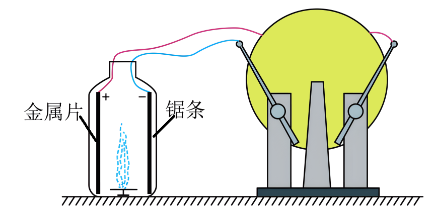

## 讲解

### 是什么

带电导体尖锐部位附近容易出现很强的电场；场足够强时，空气电离，出现可移动带电粒子，发生放电。它改变气体的导电状态，不等于金属壳内的静电屏蔽。

表面电荷密度是单位面积的电荷量，单位C/m²。尖端密度较大的结论用于常见导体形状和相应静电条件，不能凭一个“尖”字无条件断言所有环境都放电。

### 怎么来的

自由电荷重排直到导体等势；尖锐处形状使附近场变化快，局部场可增强。空气中已有少量带电粒子，强场加速它们并引起碰撞电离；产生更多载流粒子后，导体周围可以形成放电电流。

除尘装置利用锯条附近强场使空气电离，烟尘获得电荷，随后在场中向收集极运动。两过程要区分：先让粒子带电，再由电场力把粒子收集，并非起电机运转前必须人为预先给每粒尘带电。

### 什么时候能用

资料举尖形点火电极、高压设备避免尖锐表面等应用。分析时看目的：利用局部强场促成放电，还是把表面做光滑减少不希望的放电。

资料把避雷针简写为“尖端放电避免雷击”，讲解补正：完整防雷系统接闪并提供通向大地的导电路径，不是保证闪电不发生或不击中建筑。这一点按[美国国家气象局的避雷针说明](https://www.weather.gov/safety/lightning-rods)核对。

## 例题

> 题目与解析：第九章 静电场及其应用（专项训练）（解析版）.docx，来源ID S02，第297—308段。题目背景与原资料标注照录。

24．（24-25高二上·浙江台州·期末）如图所示，一个没有底的空塑料瓶上固定着一根铁锯条和一块易拉罐（金属）片，把它们分别跟静电起电机的两极相连，锯条接电源负极，金属片接正极。在塑料瓶里放一盘点燃的蚊香，很快就看见整个透明塑料瓶里烟雾缭绕。当摇动起电机，顿时塑料瓶清澈透明，停止摇动，又出现烟雾缭绕。下列说法正确的是（　　）

A．室内的空气湿度越大，实验效果越好

B．起电机摇动时，塑料瓶内存在的是匀强电场

C．起电机摇动前，烟尘颗粒带上电荷才能做成功

D．带电的烟雾颗粒向着金属片运动时，电势能减少

**原资料答案：** D

**原资料详解：** 

A．潮湿的空气易于导电，则起电机产生的静电不容易在铁锯条和金属片上积累，则该实验不易成功，故A错误；

B．起电机摇动时，锯条处聚集的电荷最密集，塑料瓶内存在的是非匀强电场，故B错误；

C．锯条和金属片间的电场让空气电离，电离出的电子让烟尘颗粒带负电，不需要让烟尘颗粒先带上电荷才能做成功，故C错误；

D．带电的烟雾颗粒向着金属片运动时，电场力做正功，电势能减少，故D正确。

故选D。

### 顺着本题再看清一步

A错误，潮湿使电荷不易积累；B错误，锯条附近与其他位置场不相同，不能视为匀强；C错误，运行中电离可使烟尘带电；D正确，带电烟尘在吸引力作用下向金属片运动，电场力做正功，对应电势能减少。

这里电势能减少不是所有粒子“靠近任意电极”都成立，必须先根据电荷符号与实际电场力方向判断功。

## 易错

湿润能帮助静电泄漏，在要积累静电的演示中会削弱效果；防静电场景与静电实验要求不同，不能只记“越干燥越好”或“越湿越好”。
