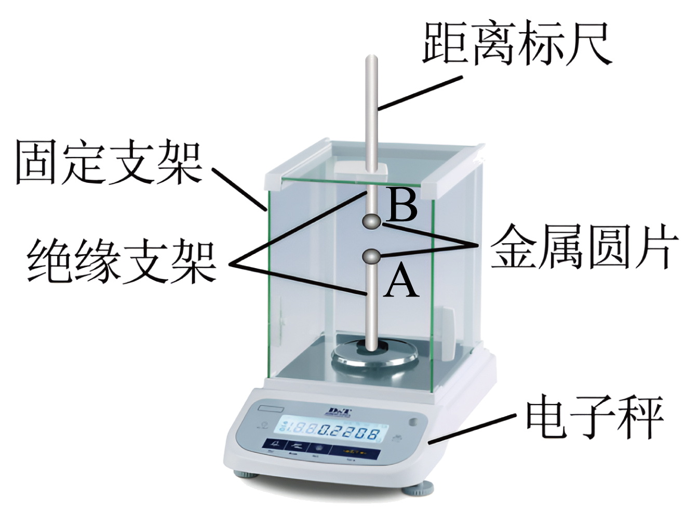

## 讲解

### 是什么

真空中两个静止点电荷的静电力大小与电荷量大小乘积成正比、与距离平方成反比。方向沿两电荷连线，同号排斥、异号吸引。

$$F=k\frac{|q_1q_2|}{r^2}$$

F单位N，q单位C，r单位m；k约9.0×10⁹ N·m²/C²。这个式子给大小，方向另判；若不用绝对值却把负结果当“负的力大小”，就混淆了大小与分量。

### 怎么来的

库仑用扭秤把很小的静电力表现为可观测扭转，控制电荷量与距离分别改变，建立定量规律。定性观察“距离越远力越小”还不能直接证明平方反比。

固定q₁、q₂，将r变为2r，代入得F′＝k|q₁q₂|/(2r)²＝F/4；固定r，只把q₁减半，则F减半。两电荷作用是一对相互作用力，第三定律保证大小相等，即使电荷量并不相等。

多个给定点电荷同时作用时，先算每一对作用，再用矢量叠加求目标电荷的合力。不能把各力的大小一律相加。

### 什么时候能用

严格条件是真空、静止点电荷；高中在空气且题目忽略介质影响时常近似使用。电荷运动显著、介质或有限分布不可忽略时，不能只照搬此式。

“第三个电荷不改变原来一对作用”指原有位置和电荷分布保持给定的点电荷模型；真实导体可能受第三物体影响发生电荷重分布。接触平分电荷还需相同导体及对称分离条件。

## 例题

> 题目与解析：第九章 静电场及其应用（单元测试·基础卷）（解析版）.docx，来源ID S06，第83—94段。题目背景与原资料标注照录。

8．如图是探究库仑力的装置，将两块金属圆片A、B分别固定在绝缘支架上，下支架固定在高精度电子秤的托盘上，上支架贴上距离标尺，穿过固定支架的小孔安置。现将电子秤示数清零，此时电子秤示数为零，给A、B带上同种电荷，A、B电荷可看成点电荷。下列说法正确的是（　　）

A．实验中A、B所带电荷量可以不相等

B．A对B的库仑力与B对A的库仑力大小相等

C．电子秤的示数与A、B间的距离成反比

D．用与A相同且不带电的金属圆片C与A接触后移开，电子秤的示数减半

**原资料答案：** ABD

**原资料详解：** 

A．库仑力是电荷间的相互作用力，库仑力与电荷所带电荷量的多少有关，与电荷间的距离有关，在探究库仑力的规律时，不一定A、B所带电荷量必须相等，A正确；

B．A对B的库仑力与B对A的库仑力是一对相互作用力，故大小相等，B正确；

C．两电荷间的库仑力与它们间的距离的二次方成反比，C错误；

D．用与A相同且不带电的金属圆片C与A接触后移开，则C与A分别所带电荷量是原A所带电荷量的一半，因A、B间的库仑力与它们所带电荷量的乘积成正比，所以电子秤的示数将减半，D正确。

故选ABD。

### 顺着本题再看清一步

A正确，q_A与q_B不必相等；B正确，两个方向相反的相互作用力大小相等；C把1/r²写成1/r；D接触相同中性圆片后，按本题理想化的平分条件q_A减半，q_B及距离不变，所以清零后的示数减半。

平分这一操作所需的对称条件由题目模型隐含采用；若接触时受到显著外场而破坏对称，不能仅因圆片相同就无条件照搬。

## 易错

平方反比不是距离反比；电子秤清零后的增量才对应静电力造成的压力变化，不能把未清零的总示数也按比例变化。
