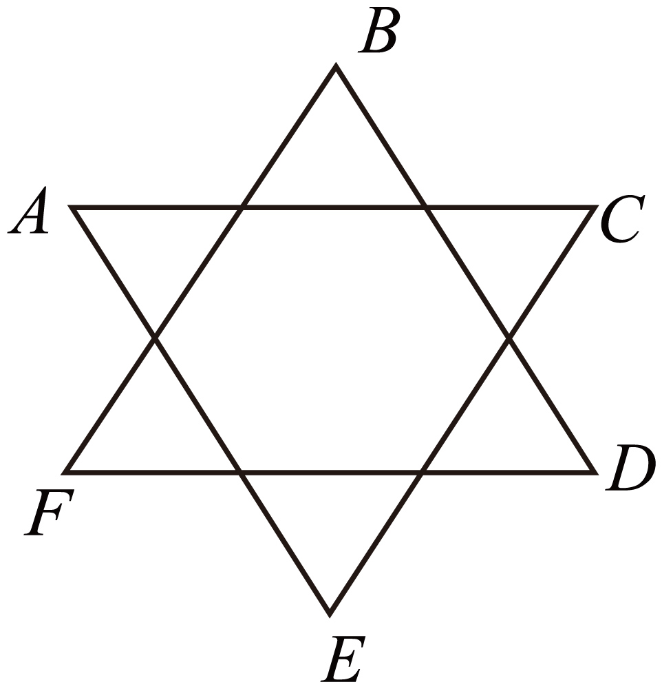

## 讲解

### 是什么

两点电势差U_AB＝φ_A−φ_B，又叫电压。下标顺序规定先A后B，不是电势变化量φ_B−φ_A。U_BA＝−U_AB。电势差单位V，是有正负的标量。

$$W_{AB}=qU_{AB}$$

q带正负号，W是从A到B的静电力功。正电荷顺高到低做正功；负电荷同样移动时做负功，不能一律用电压大小乘电荷大小。

### 怎么来的

从E_p＝qφ与W_AB＝E_pA−E_pB出发，代入得到W_AB＝qφ_A−qφ_B＝q(φ_A−φ_B)＝qU_AB。只有同一个电荷从A到B，q才能提出为共同因子。

把零点改变同一个常数c，φ_A′＝φ_A+c、φ_B′＝φ_B+c，相减时c抵消，所以电势差不依赖零点。U_AB＝W_AB/q说明用正单位电荷可测其数值，不表示任意改变q就改变原电压。

匀强场中，恒力功W＝qE·Δr，与qU比较并约去q，得U＝E·Δr。若写大小式U＝Ed，d应为沿场方向的有符号投影；斜向位移的全长不能直接代入。

### 什么时候能用

qU是静电场任意路径的电场力功，可用于非匀强场；U＝Ed定量使用还要求场在区域内匀强。非匀强场可在足够小区域近似分析，或按各小段的电势降累加，不用一个任意E乘总距离。

题目说“加速电压U”时常把U作为正的幅值，而qU正功须与实际起终点及电性核对，不能给电子直接把q＝−e与一个正幅值相乘后误判减速。

## 例题

> 题目与解析：第十章 静电场中的能量（单元测试·基础卷）（解析版）.docx，来源ID S06，第76—97段。题目背景与原资料标注照录。

6．如图为一正六角星图形，ABCDEF为其六个顶点。空间内存在一平行于纸面的匀强电场，将一质量为m、带电荷量为＋q的粒子，从A点移到B点电场力做功为W（W＞0），从A点移到D点电场力做功也为W。已知AC边长为L，下列说法正确的是（　　）

A．A、B两点间的电势差为$\frac{\sqrt3W}{3q}$

B．匀强电场的电场强度为$\frac{\sqrt3W}{qL}$

C．将带电粒子从A点移到E点，电场力做功为$\frac W2$

D．将带电粒子从A点移到F点，电场力做功为$\frac W2$

**原资料答案：** B

**原资料详解：** 

A．根据$qU=W$可知，A、B两点间的电势差为

$U_{AB}=\frac Wq$

故A错误；

B．根据题意可知BD为等势线，则有

$Ed=U_{AB}$

其中

$d=\frac23L\cos30^\circ$

解得

$E=\frac{\sqrt3W}{qL}$

故B正确；

C．AE也为等势线，将带电粒子从A点移到E点，电场力做功为0，故C错误；

D．将带电粒子从A点移到F点，电场力做功为

$W^\prime=-qE\frac L3\cos30^\circ=-\frac W2$

故D错误。

故选B。

### 顺着本题再看清一步

本题q>0且A到B、A到D均做W，所以φ_B＝φ_D，BD是匀强场的一条等势线，E垂直BD。由原图几何，A到BD的法向投影d＝(2/3)Lcos30°＝L/√3。

先算U_AB＝W/q，再E＝U_AB/d＝√3W/(qL)，B正确。A给√3W/(3q)与W/q不符；AE也是等势线，A到E功为零，C错误；A到F沿场投影反向且大小为d/2，功−W/2而非+W/2，D错误。

## 易错

U_AB与Δφ顺序相反；六角星边长L与沿场投影d不同。相同功意味着同一q到达两终点电势相同，不能意味着场强相同。
