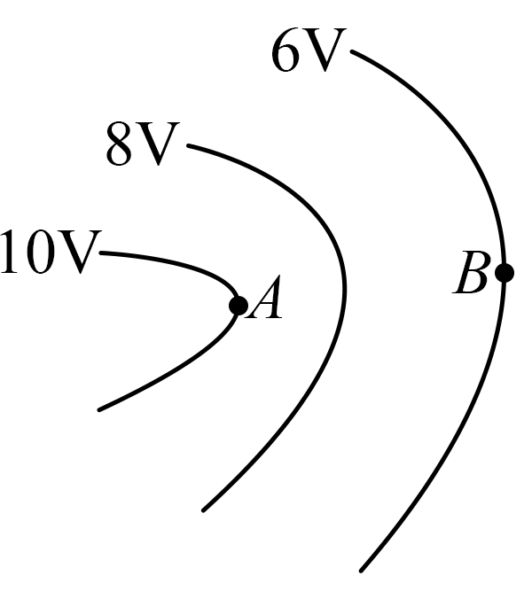

## 讲解

### 是什么

电荷与电场组成的系统因相对位置而具有电势能，记E_p，单位J。通常说“某电荷的电势能”是这个系统能量的简称。它是标量，正负表示相对于选定零点高低，不表示方向或有没有能量。

静电力做功与势能变化满足：

$$W_{AB}=E_{pA}-E_{pB}=-\Delta E_p$$

这里ΔE_p是末态减初态。静电力做正功，势能减少；做负功，势能增加。不能把所有力的总功都写成电势能减少。

### 怎么来的

静电力从A到B的功只依赖两端位置，不依赖路径；因此可以用相对于固定零点的能量记录这个做功能力。若B选为零势能位置，W_AB＝E_pA，便得到某点势能的意义。

定义电势φ＝E_p/q，反写E_p＝qφ。对同一个电荷，ΔE_p＝q(φ_B−φ_A)。正电荷的势能随φ同向变，负电荷随φ反向变；不是电势升高势能就一定升高。

若只有电场力做功，再由动能定理ΔE_k＝W_AB，代入上式得ΔE_k+ΔE_p＝0。这个守恒关系说明电场能与动能互相转化，不是说运动速度或单项能量不变。

### 什么时候能用

适用于静电场中的固定场源模型，零点必须始终一致；切换零点可改势能数值，但两点势能差、静电力做功不变。把无穷远选零常用于孤立点场源，不能给无限延伸匀强场也机械指定无穷远零点。

带电微粒还有重力、摩擦等时，ΔE_k应取全部力功之和；W电＝−ΔE_p仍成立，但E_k+E_p未必守恒。

## 例题

> 题目与解析：第十章 静电场中的能量（单元测试·基础卷）（解析版）.docx，来源ID S06，第18—32段。题目背景与原资料标注照录。

2．三条等势线如图所示，其中A、B两点在不同等势线上，下列说法正确的是（　　）

A．电子在A点的电势能为$-10\,\mathrm J$

B．电子在A点受到的电场力比B点大

C．电子从A点移动到B点，电场力所做的功为6eV

D．电子从A点移动到B点，电势能减少4eV

**原资料答案：** B

**原资料详解：** 

A．根据$E_p=\varphi q$可知，电子在$A$点的电势能

$E_p=-10\,\mathrm{eV}=-1.6\times10^{-18}\,\mathrm J$

选项A错误；

B．根据$U=Ed$可知，等差等势面越密的位置，电场强度越大，则$A$点电场强度大于$B$点，所以电子在$A$点受到的电场力大于$B$点，选项B正确；

CD．电子从$A$点移动到$B$点，电场力所做的功

$W_{AB}=-eU_{AB}=-e(\varphi_A-\varphi_B)=-4\,\mathrm{eV}$

电势能增加$4\,\mathrm{eV}$，选项CD错误。

故选B。

### 顺着本题再看清一步

图中φ_A＝10 V、φ_B＝6 V，电子q＝−e。

$$E_{pA}=(-e)(10\,\mathrm V)=-10\,\mathrm{eV},\quad W_{AB}=(-e)(10-6)\,\mathrm V=-4\,\mathrm{eV}$$

所以A写−10 J，单位与数值尺度错；B按同幅等差等势线局部间距，A附近更密场更强，正确；C说做功6 eV，正确为−4 eV；D说势能减少，实际增加4 eV。

原详解用U＝Ed说明疏密，在本题非匀强图中应理解为局部小间隔近似，不能把有限曲线间距乘一个处处相同E当精确关系。

## 易错

负电荷从高电势去低电势时势能增加，不要反着判；eV是能量单位，1 eV＝1.60×10⁻¹⁹ J，V才是电势单位。
