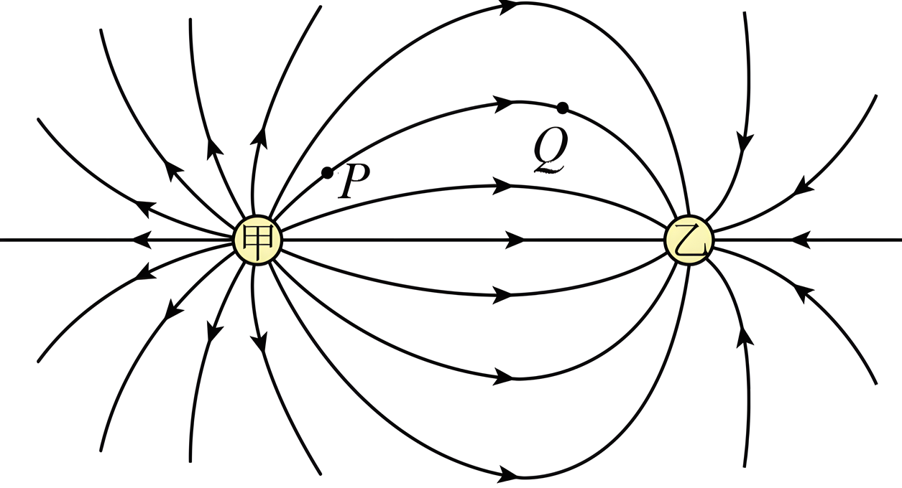

## 讲解

### 是什么

电场线是描绘场分布的有向曲线，每点切线方向表示该点场强方向；同一规范的同幅图中，线密处场强较大。它是表达工具，不是空间中真实存在的丝线，也不是自动等于粒子轨迹。

静电场线由正电荷或无穷远出发，终止于负电荷或无穷远。非零场处一条线有唯一切线方向，场线不能相交；零场点不能硬画一个唯一方向。

### 怎么来的

先在许多位置画场强箭头，再连接与箭头相切的曲线，就得到场线。一个正点电荷向外辐射，一个负点电荷向内汇聚。给定点电荷向外的总线数固定，而半径越大球面面积越大，图上线更疏，与E随1/r²减小相符合。

场线表示受力方向，轨迹切线却表示速度方向。速度由初始速度和之后受力的累积共同决定，不能只看当前受力方向就知道速度。若沿弯曲场线运动，速度沿切线，单独的电场力也沿切线，便没有改变速度方向所需的法向力，所以不能一般沿弯曲场线走。

### 什么时候能用

用场线先判场源正负，再判切线方向与局部疏密。比较两点场强“相同”还必须同时满足大小相等和方向相同。不同图若人为选取的线数不同，不能直接用线条数量比较绝对强弱。

点电荷两点同一径向线上方向可相同、大小不同；匀强场线等距平行。图上没有画线的空白区域不表示没有场。

## 例题

> 题目与解析：第九章 静电场及其应用（专项训练）（解析版）.docx，来源ID S02，第199—209段。题目背景与原资料标注照录。

16．（24-25高二上·湖北武汉·期末）如图所示是描述甲、乙两个点电荷电场的部分电场线，下列说法正确的是（　　）

A．甲带负电，乙带正电

B．甲的电荷量小于乙的电荷量

C．P点的电场强度大于Q点的电场强度

D．在P点由静止释放一个带正电的粒子，仅在静电力的作用下，粒子会沿电场线运动到Q点

**原资料答案：** C

**原资料详解：** AB．电场线从甲出发，部分终止于乙，所以甲带正电，乙带负电，且甲的电荷量大于乙的电荷量，故AB错误；

C．由于P点处的电场线比Q点处密集，所以P点的电场强度大于Q点的电场强度，故C正确；

D．由于P点和Q点在同一条电场线上且电场线为曲线，所以该粒子仅在静电力作用下不可能沿电场线运动，故D错误。

故选C。

### 顺着本题再看清一步

A错，箭头从甲出发，甲正乙负；B错，按题图完整的定性分布甲有更多向外的场线；C正确，P附近比Q密；D错，曲线场线的切线力无法提供沿该曲线运动所需法向加速度。

原图是“部分场线”，本题按图示分布读电荷量关系；若一般示意图没有线数与电荷量的统一约定，不能只数截取到的一小块线数去反推总电荷。

## 易错

曲线的切线方向是E，粒子速度应沿运动轨迹的切线；“正粒子静止释放”只保证刚开始加速度沿E，不保证后续沿弯曲场线。
