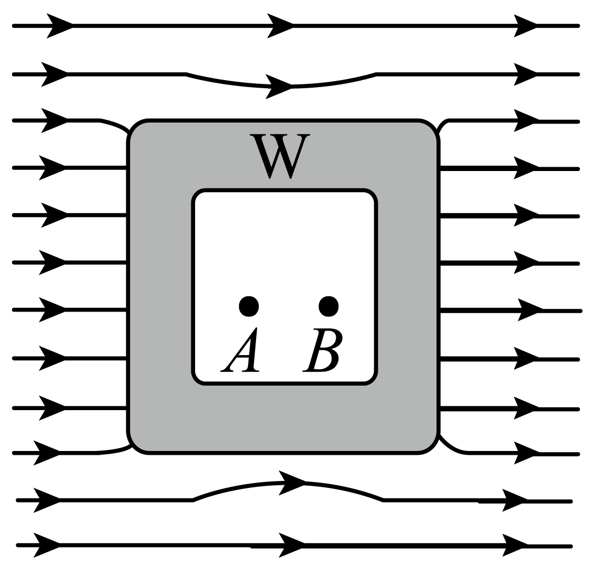

## 讲解

### 是什么

静电屏蔽是用导体外壳使腔内区域免受外部静电场影响。封闭导体处于静电平衡，腔内没有电荷时，腔内合场强为零；外部场源依然存在，导体外侧场也不必为零。

金属壳无需为了屏蔽外部静电场而一定接地。若要使腔内电荷不对外产生额外电场，通常还须接地，并核对外部没有其他场源。

### 怎么来的

外场促使导体表面电荷重排；平衡后壳体等势。无电荷的封闭空腔由等势壁包围，腔内无法维持由外部场带来的电势差，因此腔内外场与感应场相抵。

腔内放入电荷时，它自己的场与内表面感应场可在腔内存在，壳体材料内仍零场。孤立中性壳的外表面还可能出现相应净电荷，所以不能说“有金属壳就内外互不影响任何量”。接地给电荷流入流出的通道，是另一项条件。

### 什么时候能用

用来理解仪器金属罩、屏蔽电缆及本章理想导电网罩。网孔有限，网罩屏蔽一般为近似，效果取决于网孔与所研究尺度；不能把任何稀疏金属网当严格封闭壳。

本条讨论静电或准静态模型。无线信号干扰器通过发射干扰信号工作，不能因名字叫屏蔽就归为静电屏蔽。交变电磁场、特别是磁场屏蔽也不能直接由静电结论推出。腔内电荷条件参照[OpenStax](https://openstax.org/books/university-physics-volume-2/pages/6-4-conductors-in-electrostatic-equilibrium)。

## 例题

> 题目与解析：第九章 静电场及其应用（专项训练）（解析版）.docx，来源ID S02，第343—353段。题目背景与原资料标注照录。

27．（24-25高二上·北京顺义·期末）一个不带电的空腔导体放入匀强电场$E_{0}$中，达到静电平衡后，导体外部电场线分布如图所示。W为导体壳壁，A、B为空腔内两点。下列说法正确的是（　　）

A．感应电荷在A、B两点场强相等

B．金属导体内外表面存在电势差

C．金属发生感应起电，左端外表面的感应电荷为负，右端外表面的感应电荷为正

D．金属处于静电平衡时，金属内部的电场强度与静电场$E_{0}$大小相等、方向相反

**原资料答案：** AC

**原资料详解：** AD．根据静电平衡下导体内部特征，金属内部被静电屏蔽，金属内部的电场强度为0，此时金属内部的感应电场强度与静电场电场强度大小相等、方向相反，故感应电荷在A、B两点场强相等，故A正确，故D错误；

B．根据静电平衡下导体内部特征，金属整体是等势体，金属导体内外表面电势差为0，故B错误；

C．金属放在静电场中会发生感应起电，左端外表面的感应电荷为负，右端外表面的感应电荷为正，故C正确；

故选AC。

### 顺着本题再看清一步

本题腔内没有电荷，因此A、B均处于零总场区。A项说的是感应电荷的场：它恰抵消同一个匀强E₀，两点相同；D项说总场，应为零而非−E₀。B的电势差不成立，C的左负右正分布成立，答案AC。

导体放进去后外部场线已经弯曲，这说明它改变附近场分布；屏蔽成立并不要求外部场线仍与原来一样。

## 易错

把“材料内部零场”与“无电荷空腔零场”混用；把外场不进入与外侧完全无场混用；把接地当成屏蔽外场的唯一必要条件。
