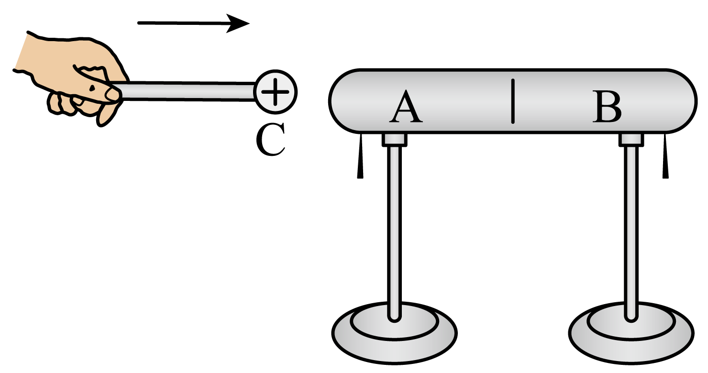

## 讲解

### 是什么

把带电体靠近导体但不接触，导体自由电子受力重新分布，出现局部带电，叫静电感应。原本中性且孤立的导体仍可总电荷为零：近端和远端带异号，不等于它从外界得到了净电荷。

常用“近异远同”指外界带电体靠近原本中性的简单导体时，近端电性与场源异号，远端同号。**感应现象与感应起电要分开**：要使分开的导体留下净电荷，还需要分离或接地等操作。

### 怎么来的

带正电的小球靠近左端，自由电子向左移动；左端电子过量带负电，右端缺电子带正电。若先撤走小球而两端仍相通，电子重新分布，孤立整体恢复中性；若小球仍在时先分开两部分，电荷转移通道被切断，再撤走小球，两部分留下等量异号净电荷。

接地法中，保持正场源在附近时接地，地球的电子可进入导体；先断开地线，再移走场源，导体保留净负电。顺序相反，导体仍接地时移走场源，电子有通道流回，最终不一定留下净电荷。

### 什么时候能用

这套电子跨导体移动的解释适用于金属导体。绝缘体不能照搬“自由电子从一端移到另一端”的模型，但可发生极化而受带电体吸引，不能说绝缘体完全不响应电场。

“接地远端不再带电”是某些示意题的简化，真实表面分布须由形状和外场决定，不能推出所有接地导体的远端任何位置场强或电荷密度都严格为零。极化与感应边界参照[OpenStax](https://openstax.org/books/university-physics-volume-2/pages/5-2-conductors-insulators-and-charging-by-induction)。

## 例题

> 题目与解析：第九章 静电场及其应用（专项训练）（解析版）.docx，来源ID S02，第32—43段。题目背景与原资料标注照录。

3．（24-25高一下·江苏苏州·期末）如图所示，在感应起电实验中，带正电的小球C靠近不带电的枕形体，下列说法正确的是（    ）

A．枕形体A、B可采用绝缘材料制作

B．仅A下端的金属箔片会张开

C．枕形体A中的正电荷移到B中

D．分开A、B，再拿走C，则A和B下端的金属箔片仍张开

**原资料答案：** D

**原资料详解：** 

A．枕形体A、B不可以采用绝缘材料制作，否则实验现象会消失，故A错误；

B．根据感应起电可知，枕形体的A端带负电，B端带正电，则A、B下端的金属箔片均会张开，故B错误；

C．金属中能自由移动的是负电荷电子，正电荷不能移动，故C错误；

D．分开A、B，再拿走C，则枕形体的A端仍带负电，B端仍带正电，A和B下端的金属箔片仍张开，故D正确。

故选D。

### 顺着本题再看清一步

A要求绝缘材料，无法完成题中自由电子跨两部分转移的过程；B只看近端，漏掉远端缺电子也会使箔片张开；C错把金属正离子当移动电荷；D先分开切断通道，再拿走C，保留局部净电荷，因此正确。

原题D并不要求撤源后保持原来的表面电荷分布；保留的是各部分净电荷，电荷仍会在各部分表面重新分布。

## 易错

张角说明同一组箔片同号相斥，不能只凭张开判断正负；撤源与分开导体的顺序会改变最终结果。
