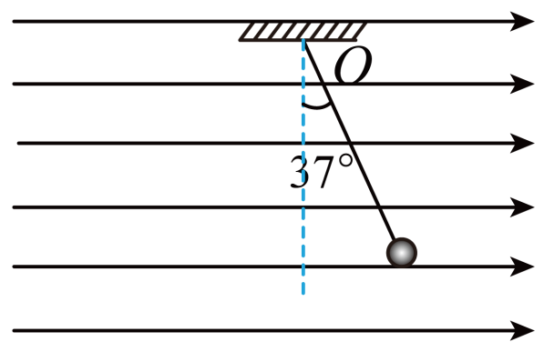

## 讲解

### 判据

已知场强方向、带电粒子偏向或静止悬浮时，用正负号把E与F联系；反过来由力方向确定电性，要先从完整受力图找出电场力。绳的斜向不能直接当作电场方向。

### 流程

1. **画独立的受力。** 小球受mg向下、绳力沿绳指向悬点、电场力方向待判。平衡时先让三个力合为零，不额外添“平衡力”。
2. **确定电场力实际方向。** 绳力水平分量向左，所以电场力水平向右；再与题给E向右对照，得到q为正。
3. **列分量平衡。** 竖直Tcos37°＝mg，水平Tsin37°＝qE。两式相除消去T，得tan37°＝qE/(mg)。这里角度相对于竖直，所以竖直用cos，不能反过来。
4. **先代小量，再核单位。** mg＝0.01×10＝0.1 N，tan37°＝0.6/0.8＝0.75；qE＝0.075 N，除q＝2.0×10⁻⁸ C得E＝3.75×10⁶ N/C。T＝0.1/0.8＝0.125 N。
5. **若题目改场强，重新看合力。** 原平衡关系只是该时刻的条件，不保证改变后小球仍平衡；不要把E变化直接理解成q改变。

## 例题

> 题目与解析：第九章 静电场及其应用（单元测试·基础卷）（解析版）.docx，来源ID S06，第95—108段。题目背景与原资料标注照录。

9．用轻质柔软绝缘细线，拴一质量为1．0×$10^{-2}$kg、电荷量为2.0×$10^{-8}$C的小球，细线的上端固定于O点。现加一水平向右的匀强电场，如图平衡时细线与铅垂线成37°（g取10m/$\mathrm{s}^{2}$，sin37°=0.6，cos37°=0.8），则（　　）

A．小球带正电

B．匀强电场的场强为1.5×$10^{8}$N/C

C．平衡时细线的拉力为0.125N

D．平衡时细线的拉力为0.175N

**原资料答案：** AC

**原资料详解：** 

A．对小球进行受力分析，根据平衡条件可知，小球受到的电场力水平向右，与电场方向相同，则小球带正电，故A正确；

BCD．以小球为对象，根据受力平衡可得

$\tan37^\circ=\frac{qE}{mg}$，$T\cos37^\circ=mg$

解得

$E=3.75\times10^6\,\mathrm{N/C}$，$T=0.125\,\mathrm N$

故C正确，BD错误。

故选AC。

### 顺着本题再看清一步

A正确，电场力与E同向；B数值1.5×10⁸ N/C与计算不符；C正确；D错，0.175 N不是由竖直平衡得到的张力。

若改为负电荷而保持同一E，电场力会反向；这说明电性影响力，不是让场强方向随小球改变。

## 易错

电场方向以正电荷受力为准；受力图中绳力、重力和电場力是三个实际力，不能把qE或mg重复计入。
