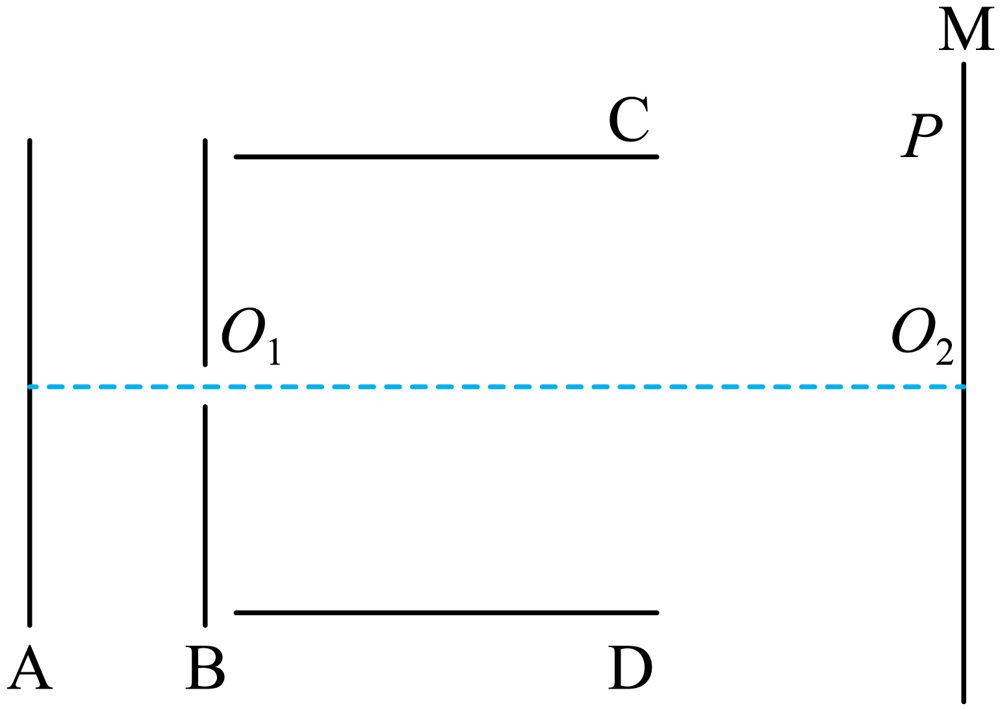

## 讲解

### 判据

粒子以初速度v₀平行极板进入、E与初速度垂直，场匀强且忽略重力及相互作用时，按两个分量共享同一时间分析。先核是否撞板，再谈从右端射出。若进入前经历从静止加速，还可消去q/m比较同电性粒子轨迹。

本题原详解总时间式提公因子后的最后一项漏两个根号，正文用两项各自正确的时间式，并在例题后更正。

### 流程

1. **定轴和力。** x沿v₀，y沿实际电场力。x无力，v_x＝v₀；y恒加速度a_y＝qE_y/m，q带符号。下式若U₂作正幅值、y沿正粒子受力，则a_y＝qU₂/(md)。
2. **由板长定共用时间。** x＝v₀t，右端x＝L₂给t₂＝L₂/v₀。不是拿板距d作为水平飞行路程。
3. **算偏移和出射方向。** y＝(1/2)a_yt₂²，v_y＝a_yt₂，tanθ＝v_y/v₀；板外不受力时沿出射速度作匀速直线，屏上位移还加板外水平距离乘tanθ。
4. **检查中线与边界。** 从中线进入、恒定单方向偏转时，要使整个板内轨迹满足|y|≤d/2；若已撞板，t₂不能再取完整L₂/v₀作为实际在场时间。
5. **对加速后偏转联立。** 同电性粒子从静止经过加速电压U₁，qU₁＝(1/2)mv₀²，故v₀²＝2qU₁/m。代入y＝qU₂L₂²/(2mdv₀²)，约掉q/m，得y＝U₂L₂²/(4U₁d)；tanθ同理为U₂L₂/(2U₁d)。轨迹、方向相同，但飞行时间与√(m/q)成比例。
6. **反号粒子重新判能否进入。** 电子从原质子加速器的同一位置静止释放，力向相反方向，不能先假定它进入偏转区再说偏向下。

## 例题

> 题目与解析：第十章 静电场中的能量（单元测试·提升卷）（解析版）.docx，来源ID S10，第112—136段。题目背景与原资料标注照录。

7．如图所示，平行金属板A、B间为加速电场，平行金属板C、D间为偏转电场，M为荧光屏。一质量为m、电荷量为q的质子，从A板附近由静止出发，经过加速电场加速后，沿中线$O_{1}O_{2}$水平射入偏转电场，最终打在荧光屏上的P点。不计粒子重力，则下列说法正确的是（　　）

A．质子从C、D间射出电场后做抛体运动

B．若氦原子核（质量为4m，电荷量为2q）从同一位置由静止释放，在两电场中的运动总时间更长

C．若氦原子核（质量为4m，电荷量为2q）从同一位置由静止释放，最终打在P点与$O_{2}$点之间的某点

D．若电子从同一位置由静止释放，将打在荧光屏上$O_{2}$点以下的位置

**原资料答案：** B

**原资料详解：** 

A．质子从C、D间射出电场后，不受力的作用，将做匀速直线运动，故A错误；

B．设AB两板间距为$L_{1}$，则粒子在加速电场中有

$L_1=\frac12a_1t_1^2$

$a_1=\frac{Eq}{m}=\frac{qU_1}{mL_1}$

$v_0=a_1t_1$

所以

$t_1=\sqrt{\frac{2mL_1^2}{qU_1}}$

设CD板长为$L_{2}$，则

$t_2=\frac{L_2}{v_0}=\sqrt{\frac{mL_2^2}{2qU_1}}$

所以在两电场中的运动总时间

$t=t_1+t_2=\sqrt{\frac{2mL_1^2}{qU_1}}+\sqrt{\frac{mL_2^2}{2qU_1}}=\sqrt{\frac mq}\left(\frac{2L_1^2}{U_1}+\frac{L_2^2}{2U_1}\right)$

由于氦原子核比荷更小，所以氦原子核运动总时间更长，故B正确；

C．粒子从CD射出后，偏移量为

$y=\frac12a_2t_2^2=\frac12\frac{qU_2}{md}\left(\frac{L_2}{v_0}\right)^2=\frac{U_2L_2^2}{4U_1d}$

$\tan\theta=\frac{v_y}{v_0}=\frac{a_2t_2}{v_0}=\frac{U_2L_2}{2U_1d}$

由此可知，不同的带电粒子将从偏转电场的同一位置、同一方向射出，最终打在荧光屏上同一位置，故C错误；

D．若电子从同一位置由静止释放，将不能被加速，不会打在荧光屏上，故D错误。

故选B。

### 顺着本题再看清一步

A错，板外无力，做匀速直线；B正确，氦核m/q由m/q变为4m/(2q)＝2m/q，两个区域的时间都变√2倍；C错，同加速电压后的偏移和出射角与m/q无关，仍到P；D错，电子在原加速场力反向，不能从静止按原路径进入。

**原S10第129段时间式最后一步漏根号，正确写法：**

$$t=\sqrt{\frac{2mL_1^2}{qU_1}}+\sqrt{\frac{mL_2^2}{2qU_1}}=\sqrt{\frac mq}\left(\sqrt{\frac{2L_1^2}{U_1}}+\sqrt{\frac{L_2^2}{2U_1}}\right)$$

前两项正确，漏根号不影响B的比较结论。原第131段“射出后偏移量”的y实际是**离开极板时的板内偏移**；到荧光屏总偏移还要加板外段。

推论tanθ＝2y/L₂由v_y＝a_yt、y＝(1/2)a_yt²及L₂＝v₀t逐项代入得到。反向延长出射切线交初始方向于板长中点，只在这些初始条件与恒定偏转加速度下成立。

## 易错

同初速度的不同粒子偏转通常取决于q/m；经同一U₁从静止加速后、同电性且同装置的轨迹相同才可消去q/m。板外忽略重力且无场时不是抛体运动。
