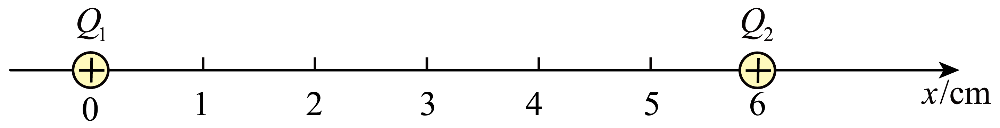

## 讲解

### 判据

真空（或可忽略介质影响）中的给定点电荷作用、接触后再分开、多个电荷共同施力时，先确认模型和新的电荷量，再计算并合成。若有限导体显著感应重排，直接套总电荷与中心距离未必成立。

### 流程

1. **列目标与来源。** 明确求哪个电荷的合力；每个其他电荷各给一个库仑力，不把相互作用两端的力同时画到一个物体上。
2. **确定当前电荷和距离。** 接触之前与之后的q不同；r取两代表点当前距离，单位用米，不能拿初距离算全过程恒力。
3. **每一对先算大小，再判方向。** F_i＝k|q₀q_i|/r_i²。同号沿远离场源方向，异号沿靠近场源方向。
4. **矢量求和。** 共线选正方向做有符号相加；不共线先分解为x、y分量，再用勾股和方向合成。只有方向相同才能直接加大小。
5. **若借助场强，仍保留符号。** 先叠加各源E_i，再F＝q₀E总；负目标电荷使受力与合E反向。不是把电荷量先相加，再任选一个距离代入。
6. **分清仪器读数的基底。** 清零后的压力变化可对应静电力；未清零总值还含原重力与支架等，比例只适用于相应增量。

## 例题

> 题目与解析：第九章 静电场及其应用（单元测试·基础卷）（解析版）.docx，来源ID S06，第83—94段。题目背景与原资料标注照录。

8．如图是探究库仑力的装置，将两块金属圆片A、B分别固定在绝缘支架上，下支架固定在高精度电子秤的托盘上，上支架贴上距离标尺，穿过固定支架的小孔安置。现将电子秤示数清零，此时电子秤示数为零，给A、B带上同种电荷，A、B电荷可看成点电荷。下列说法正确的是（　　）

A．实验中A、B所带电荷量可以不相等

B．A对B的库仑力与B对A的库仑力大小相等

C．电子秤的示数与A、B间的距离成反比

D．用与A相同且不带电的金属圆片C与A接触后移开，电子秤的示数减半

**原资料答案：** ABD

**原资料详解：** 

A．库仑力是电荷间的相互作用力，库仑力与电荷所带电荷量的多少有关，与电荷间的距离有关，在探究库仑力的规律时，不一定A、B所带电荷量必须相等，A正确；

B．A对B的库仑力与B对A的库仑力是一对相互作用力，故大小相等，B正确；

C．两电荷间的库仑力与它们间的距离的二次方成反比，C错误；

D．用与A相同且不带电的金属圆片C与A接触后移开，则C与A分别所带电荷量是原A所带电荷量的一半，因A、B间的库仑力与它们所带电荷量的乘积成正比，所以电子秤的示数将减半，D正确。

故选ABD。

### 顺着本题再看清一步

主例题答案ABD。A、B分别考电荷量不必相等与第三定律；C平方反比不是一次反比；D只改变一个电荷量，力减半。

再用本章两正点电荷原题检查矢量叠加（来源S06第17—23段）：

2．真空中有正点电荷Q1、Q2，分别固定在x轴的坐标为0和6cm的位置上。已知Q1、Q2的电荷量均为$1.6\times10^{-8}\,\mathrm C$，静电力常量为$9.0\times10^9\,\mathrm{N\cdot m^2/C^2}$，则x=2cm处的电场强度大小为（　　）

A．$2.7\times10^5\,\mathrm{N/C}$

B．$3.0\times10^5\,\mathrm{N/C}$

C．$4.0\times10^5\,\mathrm{N/C}$

D．$8.0\times10^5\,\mathrm{N/C}$

**原资料答案：** A

**原资料详解：** 根据场强叠加原则可知，x=2cm处的电场强度大小为$E=k\frac{Q_1}{r_1^2}-k\frac{Q_2}{r_2^2}=\frac{9.0\times10^9\times1.6\times10^{-8}}{0.02^2}\,\mathrm{N/C}-\frac{9.0\times10^9\times1.6\times10^{-8}}{0.04^2}\,\mathrm{N/C}=2.7\times10^5\,\mathrm{N/C}$

故选A。

在x＝2 cm点，Q₁的场向右，Q₂的场向左；r₁＝0.02 m，r₂＝0.04 m。分别算3.6×10⁵与0.9×10⁵ N/C，取向右正方向相减，得2.7×10⁵ N/C向右。A正确；B、C、D数值均不等于这个有方向的差。若只加两个大小会得4.5×10⁵ N/C，说明方向核对不能省略。

## 易错

r加倍力为四分之一；两个电荷量大小不同，相互作用力仍等大。电荷平分只在相同、对称且无明显外场影响的理想条件下使用。
