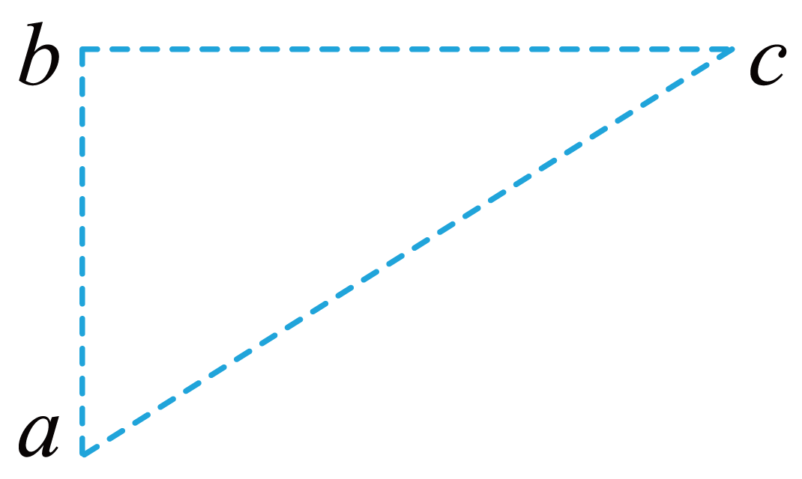
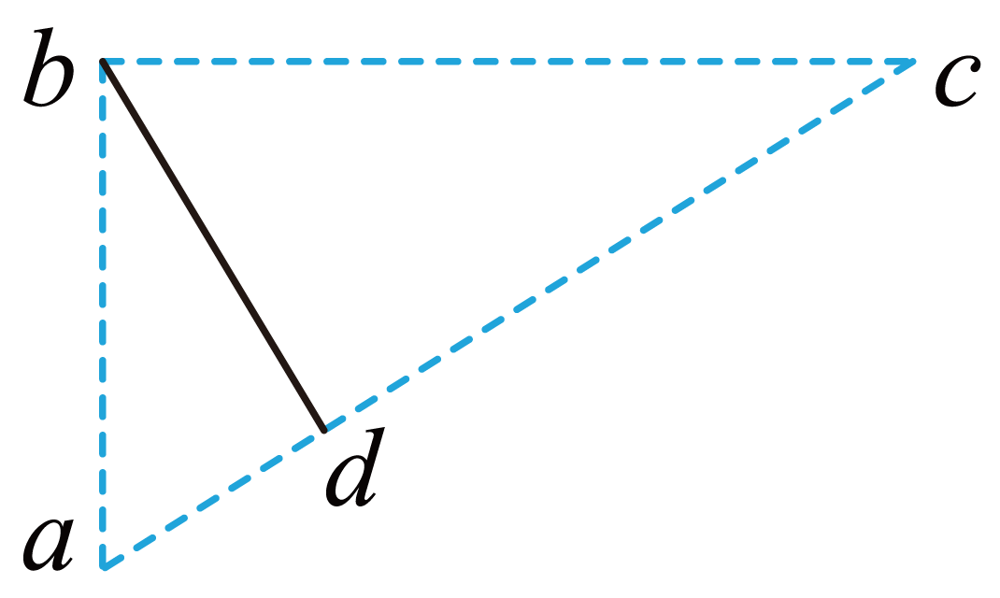

## 讲解

### 判据

题给点的电势及几何、等势线或等差等势面时，方向看法线及高到低，大小看单位法向距离的电势变化。若场不匀强，有限间距只能给局部趋势或平均变化，不能当精确点场强。

### 流程

1. **先判哪些点等势。** 本题φ_a＝φ_c＝3 V；题干明确匀强且E在纸面内，才能把ac整线当等势截线。
2. **确定方向。** E垂直ac，由3 V一侧指向−1 V的b侧；不是沿ac，也不是沿任意两点连线。
3. **量投影距离。** 过b作ac垂线至d，db＝bc sin30°＝0.04×0.5＝0.02 m。原详解第41段“作ac的连线”应理解为作垂线，图中d有直角标识。
4. **用正确电势差计算。** φ_d−φ_b＝4 V，沿E从d到b，E＝4/0.02＝200 V/m。若用bc全长，会漏掉投影因子。
5. **继续判断功与可达性。** q>0从b到c电势升高，电场功负；初动能足够并不自动保证任意初方向都能到ac，须看垂直ac的初速度分量。

## 例题

> 题目与解析：第十章 静电场中的能量（单元测试·基础卷）（解析版）.docx，来源ID S06，第33—50段。题目背景与原资料标注照录。

3．如图所示，直角三角形abc中bc=4cm，∠acb=30°。匀强电场的电场线平行于三角形abc所在平面，且a、b、c点的电势分别为3V、-1V、3V。下列说法中正确的是（　　）

A．电场强度的方向沿ac方向

B．电场强度的大小为200V/m

C．质子从b点移动到c点，电场力做功为4eV

D．质子从b点以6eV的初动能射出，必能到达ac所在直线

**原资料答案：** B

**原资料详解：** 

A．已知在匀强电场中，a、c两点的电势相等，则ac连线即为等势面，所以电场线的方向为垂直ac连线向上，故A错误；

B．过b点作ac的连线，交ac于d点，如图

所以电场强度的大小为

$E=\frac{U_{db}}{db}=\frac{3-(-1)}{4\times10^{-2}\times\sin30^\circ}\,\mathrm{V/m}=200\,\mathrm{V/m}$

故B正确；

C．质子从b点移动到c点，电势升高，电势能增大，电场力做功为

$W_{bc}=qU_{bc}=e[(-1\,\mathrm V)-3\,\mathrm V]=-4\,\mathrm{eV}$

故C错误；

D．质子从b点以6eV的初动能射出，可能做匀变速直线运动，质子能到达ac所在直线，也可能做匀变速曲线运动，不一定能到达ac所在直线，故D错误。

故选B。

### 顺着本题再看清一步

A错，E垂直ac；B正确，投影0.02 m、差4 V；C错，W_bc＝e(−1−3)V＝−4 eV；D错，若初速度沿ac，法向初动能零，法向力却指向远离ac，不能到达。

若将初速度朝ac，仍需法向初动能至少能抵偿4 eV；总6 eV没有交代这个分量，因此“必能”不成立。

## 易错

相等电势点的连线在一般非匀强场不必处处等势；“等势面密则E大”还要比较电势间隔相同并沿法向测距。
