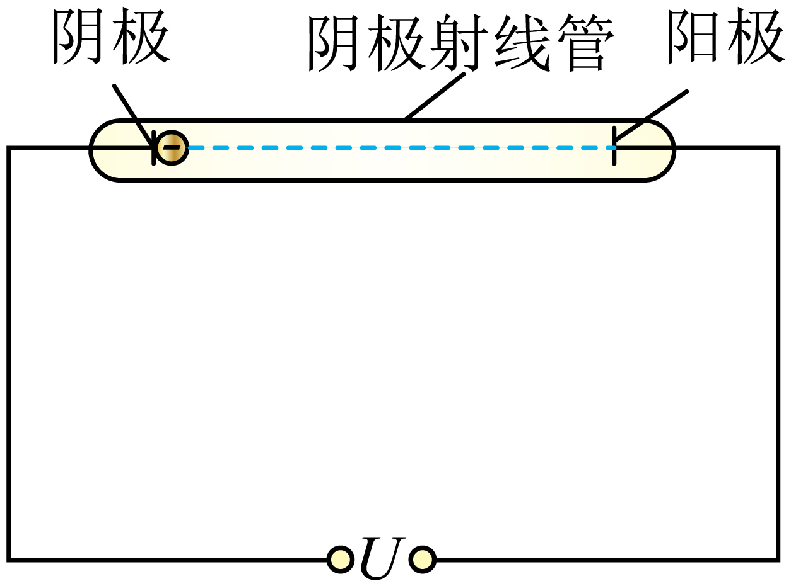

## 讲解

### 判据

只问初末速率、功或电势差，优先用动能定理；问时间、位移随时间且场匀强，优先用牛顿定律和运动学。两条路线都先判实际电场力与运动方向，不能因为q负就断言电子必减速。

### 流程

1. **确定符号与受力。** 本题阴极电势低、阳极高，电子q＝−e，受力由阴极朝阳极；加速电压U是正的幅值，电场功为eU>0。
2. **若求末速度，用能量。** eU＝(1/2)mv²−0，所以v＝√(2eU/m)。非匀强静电场也可用此式，但不能据此认为加速度恒定。
3. **本题求时间，利用匀强条件。** E＝U/d，a＝eE/m＝eU/(md)。电子从静止出发，沿加速方向d＝(1/2)at²。
4. **逐步消去a。** 两边乘2得2d＝at²，再除a得t²＝2d/a；代a＝eU/(md)，得到

$$t^2=\frac{2d}{eU/(md)}=\frac{2md^2}{eU}$$

5. **最后读比例而不把v与t混用。** 同电子m、e固定，t²正比d²、反比U。若d改变但U固定，a也因E改变，不能只按同一a的路程公式比较。

## 例题

> 题目与解析：第十章 静电场中的能量（单元测试·基础卷）（解析版）.docx，来源ID S06，第61—75段。题目背景与原资料标注照录。

5．如图为阴极射线管的简化图，在阴极射线管的阴极和阳极两端连接电压为$U\ (U>0)$的高压电源，阴极、阳极间距离为d且两极间的电场视为匀强电场，对于阴极释放的某个电子（初速度为零），从阴极运动到阳极所用时间t的平方（　　）

A．与$d^2$成正比，与U成反比

B．与U成正比，与$d^2$成反比

C．与d成正比，与$\sqrt U$成反比

D．与$\sqrt U$成正比，与d成反比

**原资料答案：** A

**原资料详解：** 根据牛顿第二定律有

$e\frac Ud=ma$

由运动学公式有

$d=\frac12at^2$

解得

$t^2=\frac{2md^2}{eU}$

可得

$t^2=\frac{2md^2}{eU}$

与$d^2$成正比，与U成反比。

故选A。

### 顺着本题再看清一步

A与t²＝2md²/(eU)一致；B把两个比例颠倒；C把d²的影响写成d且对U写错；D同样不符合。原题答案A。

还可用匀加速时平均速度v/2核验t＝2d/v，再代v＝√(2eU/m)，平方也得到同式。这一步依赖恒加速度，不能套给任意加速过程。

## 易错

能量法只给端点速度，不能单独给非匀强场的飞行时间；合力与速度共线只能在持续共线条件下保证直线，恒加速度还需恒合力。基本粒子忽略重力不等于忽略质量。
