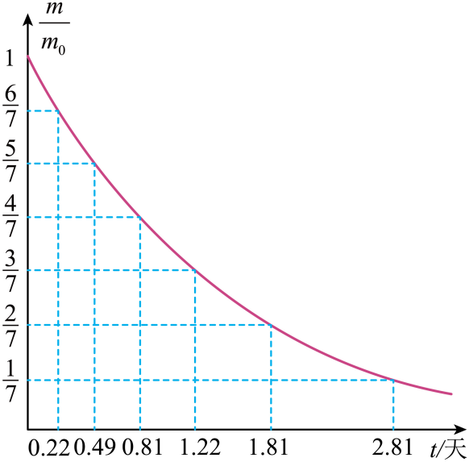

## 讲解

### 是什么

半衰期T是某放射性核素的未衰变核数下降到原来一半所需的时间。T与经过时间t必须用相同单位。N₀为初始母核数，N为t时未衰变母核数。

$$ N=N_0\left(\frac12\right)^{t/T},\qquad m=m_0\left(\frac12\right)^{t/T}. $$

m只指尚未衰变的该母核成分的质量，不是母核、子核混合后整份样品的总质量。

### 怎么来的

同种未衰变核在相同时间间隔内具有相同的存活概率。每过一个T，剩余量乘1/2；经过两个T是初始量的1/4，三个T是1/8，逐次减半就得到指数形式。

这个规律不是“每隔T都减少初始量的一半”。第二个T减半的对象是第一个T结束时的剩余核。半衰期也不是某个核的固定寿命：单核何时衰变具有随机性。

少数核仍可以讨论存活概率。一个核经过T仍未衰变的概率为1/2；大量核的实际比例才稳定地接近1/2。[OpenStax衰变概述](https://openstax.org/books/college-physics-2e/pages/31-section-summary)采用这一概率含义。

### 什么时候能用

公式用于同种核素、没有新母核补入或母核流失的衰变过程。题给化合物、溶液或污染物总质量时，先确定母核成分，不能对全部物质直接减半。

图像上任取两个纵坐标成2∶1的点，其时间差就是T。两个点不必分别是1和1/2；线性插值或把曲线当直线会误算。

## 例题

> 题目与解析：高二物理近代物理初步第五章  单元测试·提升卷（解析版）.docx，来源ID S10，第35—41段。分段选取时保留该子问的完整题干、答案与解析；题目背景和原资料标注照录。

4．质量为$m_0$的某放射性元素X经时间t后剩余未衰变质量为m，已知$\frac{m}{m_0}\text{-}t$图线如图所示，则该放射性元素X的半衰期为（　　）

A．1天

B．1.015天

C．2.81天

D．0.22天

**原资料答案：** A

**原资料详解：** 半衰期指的是放射性元素每衰变一半的时间，由题图可知从原来的$\frac47$变为原来的$\frac27$刚好经过一个半衰期，则该放射性元素X的半衰期为$T=1.81\,\text{天}-0.81\,\text{天}=1\,\text{天}$

故选A。

### 顺着本题再看清一步

A：1.81-0.81=1，正确。B的1.015天没有对应的一对“减半”读数。C的2.81天对应剩1/7，不是半衰期。D的0.22天对应剩6/7，也没有减半。用原图两点之比比猜“第一个时间刻度”更可靠。

## 易错

题图4/7在0.81天，2/7在1.81天；两者纵坐标恰好减半，因此T=1天。不是把1.81天当作从初始量减半的时间，也不是每减少1/7都需同样时间。
