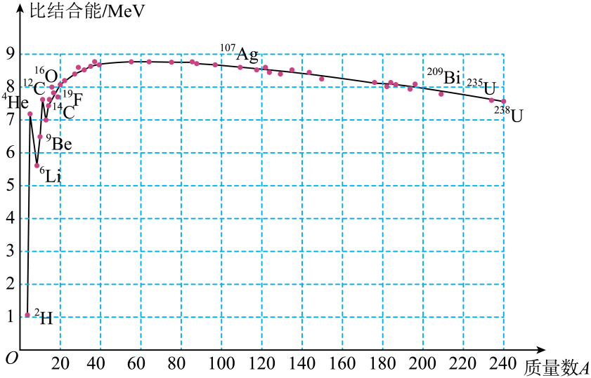

## 讲解

### 是什么

把一个原子核完全拆成相互远离的自由质子、中子，需要输入能量，这个能量称为核的结合能Eᵦ。反过来自由核子结合成该核，释放同样大小的能量。

比结合能是平均每个核子的结合能：

$$ \varepsilon_b=\frac{E_b}{A}. $$

Eᵦ常用MeV，比结合能常用MeV/核子；A为核子数。总结合能描述整核，平均值描述每个核子的平均束缚程度，不能直接互换。

### 怎么来的

核子结合时向外释放能量，结合后的系统处于较低能量状态。若再拆回自由核子，就必须补回这部分能量，因此结合能也对应“拆散所需的代价”。

核大通常核子多，总结合能可能大；要公平比较平均束缚程度，需除以核子数。把图中纵坐标读成比结合能后，总结合能应乘回A。

比结合能曲线在中等质量数附近较高。常见轻核聚变和重核裂变可使产物总结合能增加，对应放出能量；判断总能量应核对所有反应物、产物，不能只比较一个子核。

### 什么时候能用

比较平均结合紧密程度用比结合能。判断某核是否会发生某种具体衰变，还要看该衰变通道的能量、核组成与动力学条件。比结合能不是所有核素寿命的唯一排序标准。

从曲线估算核反应能量，先把每种核的平均值乘核子数，再对整条反应求差。本条讨论自由核子与完整核的能量关系；β衰变中中子、质子种类变化时，不能只减两核结合能就忽略核子静质量差。

## 例题

> 题目与解析：第五章  原子核（专项训练）（解析版）.docx，来源ID S02，第365—376段。分段选取时保留该子问的完整题干、答案与解析；题目背景和原资料标注照录。

31．（多选）（24-25高二下·新疆乌鲁木齐·期末）核能具有高效、清洁等优点，利用核能是当今世界解决能源问题的一个重要方向。原子核的比结合能曲线如图所示，则（　　）

A．${}^{107}_{47}\mathrm{Ag}$的比结合能小于${}^{140}_{58}\mathrm{Ce}$的比结合能

B．两个${}^{2}_{1}\mathrm H$核结合成${}^{4}_{2}\mathrm{He}$核的过程放出能量

C．${}^{235}_{92}\mathrm U$、${}^{16}_{8}\mathrm O$、${}^{140}_{58}\mathrm{Ce}$三者相比，${}^{235}_{92}\mathrm U$的结合能最大

D．${}^{6}_{3}\mathrm{Li}$核的比结合能小于${}^{4}_{2}\mathrm{He}$核的比结合能，因此${}^{6}_{3}\mathrm{Li}$核更稳定

**原资料答案：** BC

**原资料详解：** 

A．从比结合能曲线可以看出质量大的原子核，比结合能呈减小趋势，所以${}^{107}_{47}\mathrm{Ag}$的比结合能大于${}^{140}_{58}\mathrm{Ce}$的比结合能，故A错误；

B．比结合能越大，原子核结合越牢固，在结合过程中放出的能量越多。从比结合能曲线可知${}^{4}_{2}\mathrm{He}$的比结合能大于${}^{2}_{1}\mathrm H$的比结合能，所以两个${}^{2}_{1}\mathrm H$核结合成${}^{4}_{2}\mathrm{He}$核的过程是放出能量，故B正确；

C．结合能等于比结合能乘以核子数。对于${}^{235}_{92}\mathrm U$、${}^{16}_{8}\mathrm O$、${}^{140}_{58}\mathrm{Ce}$三者相比，虽然${}^{235}_{92}\mathrm U$的比结合能最小，但是从核子数来看，${}^{235}_{92}\mathrm U$的核子数最多。所以综合起来${}^{235}_{92}\mathrm U$的结合能最大，故C正确；

D．由于比结合能越大，原子核结合的越牢固，从比结合能曲线可知${}^{4}_{2}\mathrm{He}$核的比结合能大于${}^{6}_{3}\mathrm{Li}$核的比结合能，所以${}^{4}_{2}\mathrm{He}$核比${}^{6}_{3}\mathrm{Li}$核更牢固，故D错误。

故选BC。

### 顺着本题再看清一步

A比较的是银107与铈140在曲线上的高度，前者较大，故“小于”错。B氘核聚成氦4，按总结合能增加的方向放能。C虽铀235的平均值低于氧16等核，但其核子数多，乘A后总结合能最大。D氦4的曲线值高于锂6，后者每核子平均束缚较弱；不能由此再随意推出所有衰变寿命的排名。

## 易错

C要比总结合能，应分别用A乘图上纵坐标，不是直接挑最高的曲线点。D把“较小的比结合能”说成“更牢固”，方向相反。原解析对“越稳定”的简写，正文限定为平均束缚程度。
