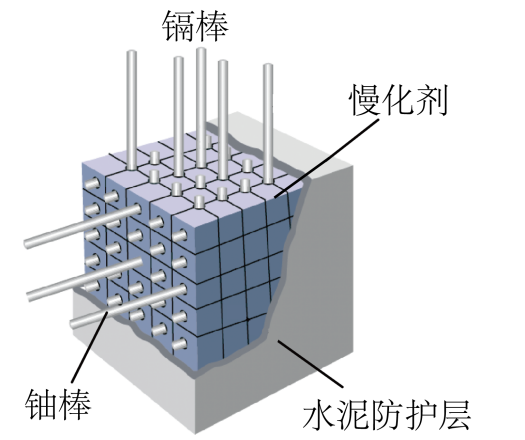

## 讲解

### 判据

反应堆题出现“减小中子能量”判慢化作用，出现“吸收中子、调节反应强弱”判控制作用。二者都影响链式反应，却不处理同一个量。

本题明确是慢中子反应堆，石墨、重水等可作慢化剂；镉棒为吸收中子的控制棒。

### 流程

1. 先把“快”解释为单个中子动能较大，“慢”解释为动能较小，不要把“中子快”误当成“反应快”。

2. 看慢化剂：中子碰撞传递动能，逐步变慢；希望降低能量并尽量保留可继续裂变的中子。

3. 看控制棒：插得越深，通常吸收越多中子，能继续引发裂变的中子越少，反应减弱；拔出则相反。

4. 防护层另承担辐射屏蔽功能，不能因为有控制棒就认为薄防护层足够，也不能把屏蔽材料一概当慢化剂。

5. 原资料C项详解把“镉棒”列在慢化剂中，是笔误和概念混用。应读作石墨、重水等慢化，镉棒吸收，题的AB答案不因此改变。

## 例题

> 题目与解析：第五章  原子核（专项训练）（解析版）.docx，来源ID S02，第237—248段。分段选取时保留该子问的完整题干、答案与解析；题目背景和原资料标注照录。

21．（多选）（24-25高二下·天津和平·期末）如图是慢中子反应堆的示意图，对核反应堆的下列说法中正确的是（　　）

A．铀235容易吸收慢中子发生裂变反应

B．快中子跟慢化剂中的原子核碰撞后，中子能量减少，变为慢中子

C．常用的慢化剂有铅棒、镉棒等，能有效减少快中子能量

D．反应堆外面的水泥防护层用来屏蔽裂变产物放出的各种射线，但是不需要很厚

**原资料答案：** AB

**原资料详解：** 

A．根据铀235的特点，它更容易吸收慢中子而发生裂变，故A正确；

B．在反应堆中减速剂的作用就是减少快中子能量从而变成慢中子，故B正确；

C．链式反应的剧烈程度取决于裂变释放出的中子总数，控制棒可以吸收中子，因而可以控制核反应的快慢，即插入越深，吸收的越多，反应将变慢，反之将加快。常用的慢化剂有镉棒、石墨棒和重水等，能有效减少快中子个数或慢化快中子，铅棒则不能。故C错误；

D．反应堆外面的水泥防护层用来屏蔽裂变产物放出的各种射线，射线的穿透能力很强，水泥防护层需要很厚。故D错误。

故选AB。

### 顺着本题再看清一步

原详解C末句“常用慢化剂有镉棒”与同段前句“控制棒吸收中子”矛盾。正文已经区分：慢化关注能量，控制关注可继续裂变的中子数量；吸收一个快中子使它消失，不能叫把这个中子减速成慢中子。

## 易错

A、B分别符合慢中子易引发裂变及碰撞减速；C混用控制材料和慢化材料；D忽视防护层厚度。本题模型不能推广成所有核反应堆都必须慢化中子。
