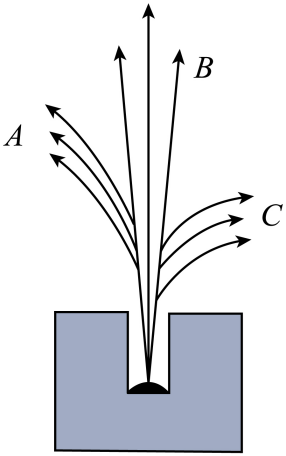

## 讲解

### 判据

题干出现射线在电场或磁场中的偏转，就先按电荷定方向，再对应α、β负、γ。典型电荷分别为+2e、-e、0；本题射线从小孔向上运动，A向左、B不偏转、C向右。

磁偏转方向还依赖运动方向和磁场方向，电偏转方向依赖电场方向。只看“左边是α”没有普遍意义。

### 流程

1. 读清射线的入射速度。本题速度向上，先固定这个方向，避免左右判断颠倒。

2. 若B向纸内，用正电荷的洛伦兹力方向判断：向上的速度与向里的B使正电荷向左，因此A是α，向右的C为β负；不偏转的B束为γ。

3. 若E向右，正电荷受力向右，负电荷向左，故C为α、A为β负。不能把磁场分配直接照搬给电场。

4. 另判本质、电离、穿透。方向只给电荷线索，不能把β的“速度高”误写成“穿透最高”；典型排序中γ穿透较强、α电离较强。

## 例题

> 题目与解析：第五章  原子核（专项训练）（解析版）.docx，来源ID S02，第23—32段。分段选取时保留该子问的完整题干、答案与解析；题目背景和原资料标注照录。

2．（23-24高二下·河南驻马店·期末）把放射源铀、钍或镭放入用铅做成的容器中，使射线只能从容器的小孔射出成为细细的一束。在射线经过的空间施加垂直于纸面的匀强磁场或水平方向的匀强电场，都可以使射线分成如图所示的A、B、C三束。则下列说法正确的是（　　）

A．若施加的是垂直纸面向里的匀强磁场，A为α射线

B．若施加的是水平向右的匀强电场，C为β射线

C．三种射线中C为高速电子流，其穿透能力最强

D．三种射线中B的电离本领最强

**原资料答案：** A

**原资料详解：** ABC．若施加的是匀强磁场，当磁场方向垂直纸面向里时，由左手定则可知，A粒子带正电，若磁场方向垂直纸面向外，C粒子带正电，若施加的是匀强电场，当电场方向水平向右时，则C粒子应带正电，β射线是高速电子流，带负电，故A正确，故BC错误；

D．三种射线中B在磁场和电场中都不偏转，即B粒子不带电，是γ射线，其穿透性最强，电离特性最弱，故D错误。

故选A。

## 易错

原题B在向右电场下把C判成β，方向错；C把电子流的穿透能力排最高，性质错；D把不偏转的γ电离作用排最高，性质也错。
