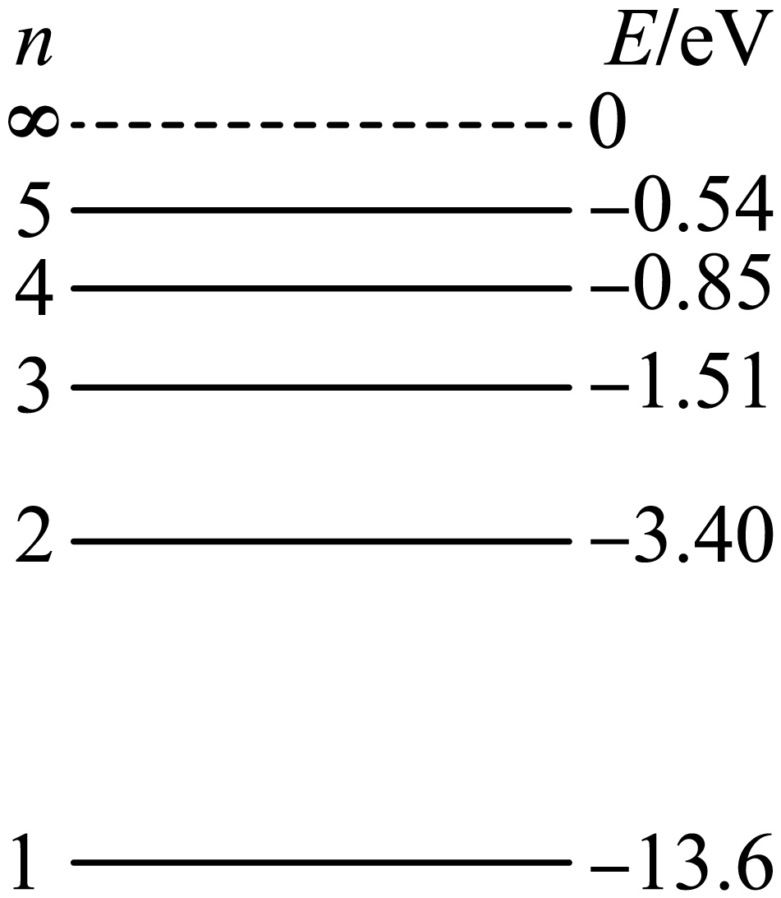

## 错法

把束缚态之间精确能级差的吸收条件，搬到束缚态进入连续自由状态的电离条件；于是认为14.0 eV不能电离基态氢，因为不是13.6 eV。

## 正解

电离最小能量为0−E初。基态氢约13.6 eV，光子达到或超过阈值可以电离，超过的能量进入自由电子等末态能量并满足动量守恒。

精确匹配适用于本章理想离散束缚态跃迁；电离后电子有连续动能范围，故超过阈值无需再找一个离散能级。处于激发态时阈值更低，不能仍统一用13.6 eV。

## 例题

> 题目与解析：第四章 原子结构与波粒二象性 （复习讲义）（解析版）.docx，来源ID S03，第306—319段。分段选取时保留该子问的完整题干、答案与解析；题目背景和原资料标注照录。

【变式7-1】 如图为氢原子能级示意图，则下列说法正确的是（　　）

A．一个处于n＝3能级的氢原子，自发跃迁时最多能辐射出三种不同频率的光子

B．一群处于n＝5能级的氢原子最多能放出10种不同频率的光子

C．处于n＝2能级的氢原子吸收2.10 eV的光子可以跃迁到n＝3能级

D．用能量为14.0eV的光子照射，不能使处于基态的氢原子电离

**原资料答案：** B

**原资料详解：** 

A．一个处于n＝3能级的氢原子，自发跃迁时，跃迁路径可能为$3\to1$或$3\to2\to1$，可知最多能辐射出2种不同频率的光子，故A错误；

B．一群处于n＝5能级的氢原子，根据$C_5^2=10$

可知最多能放出10种不同频率的光子，故B正确；

C．根据$\Delta E=E_3-E_2=1.89\,\mathrm{eV}$

可知处于n＝2能级的氢原子吸收2.10 eV的光子不可以跃迁到n＝3能级，故C错误；

D．由题图可知使处于基态的氢原子电离需要的能量最小为13.6eV，则用能量为14.0eV的光子照射，能使处于基态的氢原子电离，故D错误。

故选B。

### 顺着本题再看清一步

C和D的不同结论是关键：2.10 eV不匹配2→3的1.89 eV，14.0 eV却超过基态电离阈值。不能把“可以电离”说成所有入射光子必定被吸收。
