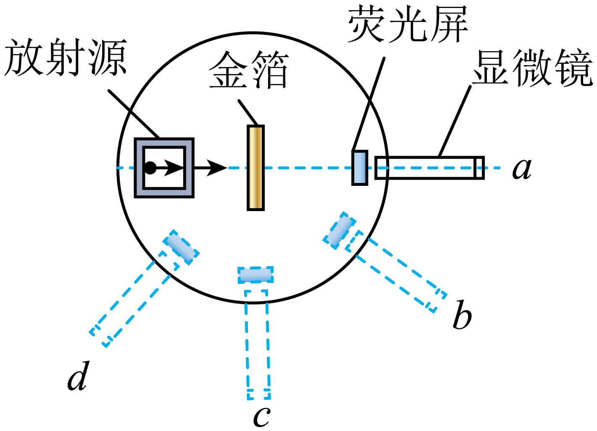

## 错法

只记住最惊人的返回现象，忽略它出现极少，就把核式模型想成原子内部到处是挡住粒子的硬核。这样既误读比例，也无法解释绝大多数直行。

## 正解

先完整读三个比例：绝大多数基本直行，少数大角，极少数返回。原子核很小，大多数路径距核远，库仑偏转弱；只有很少近核路径受到很强作用。大角事件用于证明集中结构，不用于说大部分粒子被挡回。

## 例题

> 题目与解析：第四章 原子结构与波粒二象性 （复习讲义）（解析版）.docx，来源ID S03，第266—277段。分段选取时保留该子问的完整题干、答案与解析；题目背景和原资料标注照录。

【变式6-1】α粒子散射实验装置如图所示，下列说法正确的是（    ）

A．实验现象可用汤姆孙提出的“枣糕模型”来解释

B．在c处可观察到绝大多数α粒子

C．在b、d两处，打在荧光屏上的α粒子数几乎相同

D．统计散射到各个方向的α粒子所占比例，卢瑟福提出了原子的核式结构模型

**原资料答案：** D

**原资料详解：** 

A．该实验中绝大多数α粒子穿过金箔后仍沿原来的方向前进，但有少数α粒子发生了较大的偏转，极个别α粒子甚至被反弹回来，此实验现象不可用汤姆孙提出的“枣糕模型”来解释，故A错误；

B．在a处可观察到绝大多数α粒子，在c处可观察到少数α粒子，故B错误；

C．在d处打在荧光屏上的α粒子数比在b处打在荧光屏上的α粒子数少，故C错误；

D．统计散射到各个方向的α粒子所占比例，卢瑟福提出了原子的核式结构模型，故D正确。

故选D。

### 顺着本题再看清一步

B把c处当作多数，原图直行a才是多数；C也忽略b与近返回d的计数差。散射通常是电场偏转，不必直接撞到核表面。
