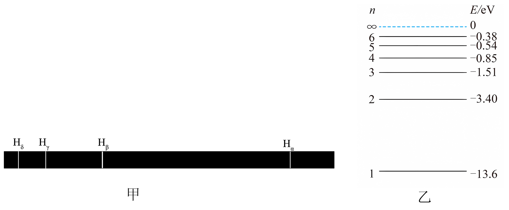

## 错法

看见能级−1.51 eV，就把从n=3降到n=2的光子记成1.51 eV，或将两负值的绝对值相加。错在能级值是按选定零点计的原子能量，转移的是初末差。

## 正解

先写Eγ=E₃−E₂，代入−1.51−(−3.40)=1.89 eV。两能级同时改变能量零点时，差值不变，这才是可测光子能量。

只有终点正好取E=0的电离阈值，所需能量才等于初能级绝对值。向较低束缚态跃迁不能拿此特例代替差值。

## 例题

> 题目与解析：第四章 原子结构与波粒二象性 （复习讲义）（解析版）.docx，来源ID S03，第320—331段。分段选取时保留该子问的完整题干、答案与解析；题目背景和原资料标注照录。

【变式7-2】图甲中$H_{α}$、$H_{β}$、$H_{γ}$、$H_{δ}$为氢原子在可见光区的四条谱线，它们分别是氢原子从能级3、4、5、6向能级2跃迁时放出的。图乙为氢原子的能级示意图，下列说法正确的是（　　）

A．谱线$H_{α}$的光子能量为3.02eV

B．四种谱线中，$H_{δ}$的光的波长最短

C．一个处于能级4的氢原子向低能级跃迁可以辐射出6种光子

D．只有能量值为13.6eV的光子才可以使处于基态的氢原子电离

**原资料答案：** B

**原资料详解：** 

A．$H_\alpha$光是能级3向能级2跃迁辐射出的，光子能量$E_\alpha=E_3-E_2=1.89\,\mathrm{eV}$，A错误；

B．四种谱线中，$H_\delta$光的光子能量最大，波长最短，B正确；

C．大量处于能级4的氢原子向低能级跃迁才可以辐射出6种光子，一个处于能级4的氢原子向低能级跃迁最多可以辐射出3种光子，C错误；

D．能量值大于等于13.6eV的光子都可以使处于基态的氢原子电离，D错误。

故选B。

### 顺着本题再看清一步

原A的3.02 eV来自错误操作，不是Hα能量；原B正确的波长比较也必须比较能级差。
