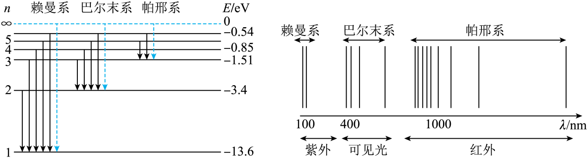

## 讲解

### 判据

题目给某种元素的多条亮线或暗线、或问光谱能否鉴别物质时，利用谱线频率组合与能级差对应。谱线多不是识别障碍，可靠的组合反而增加证据。

### 流程

1. 识别是发射亮线还是连续背景中的吸收暗线，两者都能提供对应元素的特定跃迁频率。
2. 比较测得波长与标准谱线位置，不能只看“红色”或“看起来一样亮”。有多条对应关系再判断更可靠。
3. 用能级差解释频率：本题不同谱系终能级不同，形成不同波段；同样能级差才对应相同光子频率。
4. 控制原子电离态、仪器分辨率、可能重叠的谱线，单一相似线不足以唯一证明。
5. 资料没有未知样品实测对照表，本条原题只检查C项的识别逻辑，不造标准谱线数值或未知元素答案。

## 例题

> 题目与解析：第四章 原子结构与波粒二象性 （复习讲义）（解析版）.docx，来源ID S03，第574—586段。分段选取时保留该子问的完整题干、答案与解析；题目背景和原资料标注照录。

3．（2026·重庆·二模）如图所示，关于氢原子能级和谱线图，下列说法正确的是（　　）

A．氢原子辐射光子的频率条件是$h\nu=E_n-E_m\;(m<n)$

B．处于基态的氢原子可以吸收能量为11eV的光子而跃迁到高能级

C．所有原子光谱都有多条谱线，所以不能用来鉴别物质和确定物质的组成成分

D．一个氢原子处于$n=5$激发态，向基态跃迁时，可能辐射出10种不同频率的光子

**原资料答案：** A

**原资料详解：** 

A．根据氢原子跃迁的辐射条件，氢原子从高能级n向低能级m（$m<n$）跃迁辐射光子，光子能量满足$h\nu=E_n-E_m$，故A正确；

B．基态氢原子能量为$-13.6\,\mathrm{eV}$，吸收$11\,\mathrm{eV}$光子后总能量为$-13.6\,\mathrm{eV}+11\,\mathrm{eV}=-2.6\,\mathrm{eV}$

氢原子不存在该能级，$11\,\mathrm{eV}$不符合能级差要求，不能跃迁，故B错误；

C．每种原子的原子光谱虽然有多条谱线，但不同原子都有其特征谱线，特征谱线可以用于光谱分析，鉴别物质、确定物质组成，故C错误；

D．一个处于$n=5$激发态的氢原子，向基态跃迁时，最多辐射出4种不同频率的光子（逐级跃迁），不可能辐射出10种，10种是大量氢原子跃迁的结果，故D错误。

故选 A。

## 易错

原C“有多条所以不能鉴别”反向推理；正确思路是按多条特征频率核对。原A、B、D也保留完整解析，分别考频率条件、激发匹配与谱线计数。
