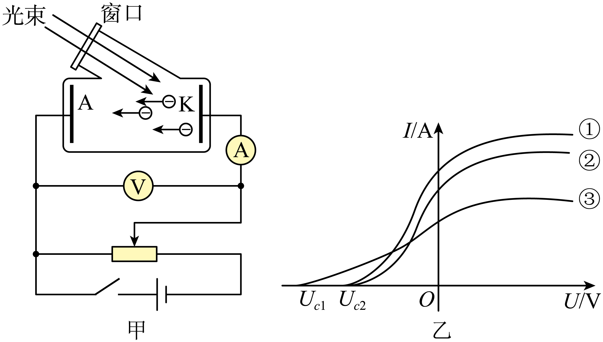

## 错法

把电子数增多误认为每个电子获得更多能量，由更高的饱和电流推出更大的遏止电压。错在混淆总入射能量、单个光子能量与最大电子动能。

## 正解

同一频率、同一材料下，hν与W₀都不变，所以E_kmax=hν−W₀不变，U_c=E_kmax/e不变。光强提高通常增加电子数量，饱和电流升高。

反过来，同材质不同频率导致U_c不同，才支持比较最大初动能。只看到光电流变化还需检查收集电压是否变化。

## 例题

> 题目与解析：第四章 原子结构与波粒二象性 （复习讲义）（解析版）.docx，来源ID S03，第165—177段。分段选取时保留该子问的完整题干、答案与解析；题目背景和原资料标注照录。

【变式3-2】（多选）图甲是光电效应的实验装置图，图乙是通过改变电源极性得到的光电流与加在阴极K和阳极A上的电压的关系图像，下列说法正确的是（　　）

A．由图甲可知，闭合开关，电子飞到阳极A的动能比其逸出阴极K表面时的动能大

B．由图甲可知，闭合开关，向右移动滑动变阻器滑片，电流表的读数一直增大

C．由图乙可知，③光子的频率小于①光子的频率

D．由图乙可知，①②是同种颜色的光，①的光强比②的大

**原资料答案：** AD

**原资料详解：** 

A．图甲所示光电管中的电场方向水平向右，电子从金属板逸出后，受到的电场力水平向左，电子做加速运动，所以电子飞到阳极A的动能比其逸出阴极K表面时的动能大，故A正确；

B．向右移动滑动变阻器滑片，光电管中电压增大，当光电管中的电流达到饱和光电流时，电流表示数将不再增大，故B错误；

C．根据光电效应方程$E_k=h\nu-W_0$，结合遏止电压$eU_c=E_k$，整理得$U_c=\frac he\nu-\frac{W_0}e$

③遏止电压大于①遏止电压，所以③光子的频率大于①光子的频率，故C错误；

D．①②遏止电压相同，①②光的频率相同，所以①②是同种颜色的光，①的饱和光电流大于②的饱和光电流，①的光强比②的大，故D正确。

故选AD。

### 顺着本题再看清一步

①②是平台不同、截点相同的直接原图证据。③平台较低却遏止电压更大，也说明电流数量与单电子能量不是一回事。
