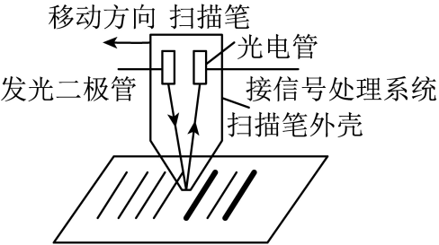

## 错法

把光能想成连续蓄进同一个电子，认为光越强或照得越久，迟早能达到逸出功。普通单光子模型中，一个吸收事件的能量是hν；低频光子的单份能量不足，不因数量变多而自动相加。

## 正解

先比较hν与W₀，或ν与ν₀。低于阈值时，增强光只增加低能光子数量，不能在本题模型中产生普通单光子光电流。超过阈值后才看光强对电子数量的影响。

方程算出hν−W₀为负，不是负动能，而是逸出条件不满足。现代强场多光子现象另有机制，不用来改写题设的普通光电效应。

## 例题

> 题目与解析：第四章  原子结构和波粒二象性（专项训练）（解析版）.docx，来源ID S02，第101—111段。分段选取时保留该子问的完整题干、答案与解析；题目背景和原资料标注照录。

9．（24-25高二下·广东东莞·期末）某款条形码扫描笔的工作原理如图所示，将扫描笔在条形码上匀速移动，发光二极管发出的光遇到黑色线条几乎全部被吸收；遇到白色线条被大量反射到光电管中的金属表面（截止频率为$\nu_0$），产生光电流。如果光电流大于某个值，就会使信号处理系统导通，将条形码变成一个个脉冲电信号。已知普朗克常量为$h$，则下列说法正确的是（　　）

A．若发光二极管发出频率为$0.5\nu_0$的光，则可以通过增加光照时间，使其正常识别条形码

B．若发光二极管发出频率为$0.5\nu_0$的光，则可以通过增加光照强度，使其正常识别条形码

C．光电子的最大初动能与发光二极管发出的光的频率成正比

D．若发光二极管发出频率为$1.3\nu_0$的光，则光电子最大初动能为$0.3h\nu_0$

**原资料答案：** D

**原资料详解：** AB．发光二极管发出的频率$0.5\nu_0<\nu_0$，不能发生光电效应，通过增加光照时间和增加光照强度，不能产生光电流，则不能正常识别条形码，故AB错误；

C．根据光电效应方程$E_{km}=h\nu-W_0$可知，光电子的最大初动能$E_{km}$与发光二极管发出的光的频率$\nu$成线性增函数，而不成正比，故C错误；

D．光电管中的金属表面的截止频率为 $\nu_0$，若发光二极管发出频率为$1.3\nu_0$的光，根据爱因斯坦光电效应方程可得光电子最大初动能为$E_{km}=1.3h\nu_0-h\nu_0=0.3h\nu_0$，故D正确；

故选D。

### 顺着本题再看清一步

A和B分别试图用时间与强度补救0.5ν₀，原解析均排除；D改为1.3ν₀才有剩余动能。
