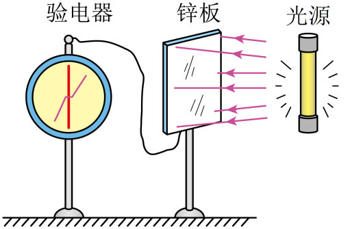

## 讲解

### 是什么

光照射金属等材料，使电子从表面逸出的现象叫光电效应。逸出的是带负电的光电子，留下的金属失去电子，可能带正电。

普通单光子光电效应有截止频率ν₀；频率低于它不能靠增加光强或延长照射打出电子。超过截止后逸出几乎没有积累能量的延迟，是否形成可测电流还要看收集电路与探测灵敏度。

### 怎么来的

一个电子吸收一个光子的能量hν，先克服逸出所需最小能量W₀，剩余最多成为出射电子动能。频率决定每个光子的能量，光强主要决定入射数量，故两者影响不同。

电子逸出前的位置、出射方向和能量损失不同，所以初动能有分布。最大初动能用于描述分布上限，不表示每个光电子都以同一速度离开。

### 什么时候能用

高中金属表面光电效应题按普通单光子、材料状态不变的模型判断。ν=ν₀是理想临界点，最大初动能为零；通常超过它讨论可测逸出电流。

电路中测不到电流还可能是反向电压遏止，不能仅凭无示数认定没有电子逸出。强场多光子效应属于另外的物理情境，不混入本章模型。

## 例题

> 题目与解析：第四章  原子结构和波粒二象性（专项训练）（解析版）.docx，来源ID S02，第67—76段。分段选取时保留该子问的完整题干、答案与解析；题目背景和原资料标注照录。

6．（24-25高二下·辽宁丹东·期末）如图所示，将验电器与一块不带电的锌板连接，此时验电器指针张角闭合，现用紫外线照射锌板，发现验电器指针张角张开，下列说法正确的是（　　）

A．用紫外线照射锌板时，锌板带负电荷

B．用紫外线照射锌板时，验电器指针带正电荷

C．若紫外线光照强度减弱，则光电子的最大初动能增加

D．若紫外线光照强度减弱，则光电子的最大初动能减少

**原资料答案：** B

**原资料详解：** AB．用紫外线照射锌板时，锌板发生光电效应，从锌板中有电子逸出，则锌板带正电，则验电器指针带正电荷，A错误，B正确；

CD．发生光电效应时，逸出光电子的最大初动能只与入射光的频率有关，与光强无关，则若紫外线光照强度减弱，则光电子的最大初动能不变，CD错误。

故选B。

## 易错

A把失去负电子的锌板判为负电；B正确，验电器相连后呈正电；C、D都错误，减弱同频紫外线不改变最大初动能。
