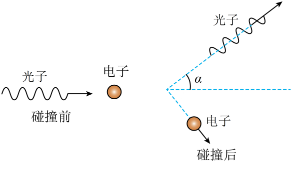

## 讲解

### 是什么

X射线经物质散射，散射光中除原波长成分外出现更长波长成分，称康普顿效应。光子在与近似自由电子的相互作用中转移能量、动量；散射光能量减少、频率下降、波长增大。

光子动量大小是$p=h/\lambda=E/c$，方向沿传播方向。光子静止质量为零，不能使用非相对论实物粒子式p=mv或E_k=p²/(2m)计算光子。

### 怎么来的

将入射与散射光当作光子，光子和电子共同满足能量、矢量动量守恒，便能解释波长改变。只有能量数量守恒还不够，碰撞改变方向时必须按分量处理动量。

初始自由电子近似静止，光子失去的能量等于电子获得的动能；不是把光子完全吸收后再说同一个光子仍存在。石墨中的未移位成分涉及束缚电子等情形，也不能说每个散射光子都一定等量损能。

### 什么时候能用

用于X射线等光子散射的粒子性证据。自由电子、初始静止、指定碰撞角度是下题的条件；高能反冲电子需要相对论动能，不擅自用p²/(2m)。核对见[OpenStax康普顿效应](https://openstax.org/books/university-physics-volume-3/pages/6-3-the-compton-effect)。

这是拓展：静止自由电子模型给$\Delta\lambda=h(1-\cos\theta)/(m_ec)$，θ为光子散射角。没有转角θ=0时位移可为零。

## 例题

> 题目与解析：第四章  原子结构和波粒二象性（专项训练）（解析版）.docx，来源ID S02，第302—326段。分段选取时保留该子问的完整题干、答案与解析；题目背景和原资料标注照录。

25．（多选）（23-24高二下·山东聊城·期末）康普顿在研究石墨对射线的散射时，发现在散射的射线中，除了与入射波长$\lambda_0$相同的成分外，还有波长大于$\lambda_0$的成分。如图所示，在某次碰撞中，入射光子与静止的无约束自由电子发生弹性碰撞，碰撞后光子的方向与原入射方向成$\alpha$角，与电子碰后的速度方向恰好垂直，已知普朗克常量为h，光速为c。下列说法正确的是（　　）

A．入射光的光子动量大小为$\frac{\lambda_0}{h}$

B．入射光的光子能量为$\frac{hc}{\lambda_0}$

C．碰撞后电子的动能为$\frac{hc}{\lambda_0}-\frac{hc\cos\alpha}{\lambda_0}$

D．碰撞后光子的动量大小为$\frac{h\sin\alpha}{\lambda_0}$

**原资料答案：** BC

**原资料详解：** 

A．入射光的光子动量大小为$\frac h{\lambda_0}$，故A错误；

B．入射光的光子能量为

$E=h\nu=\frac{hc}{\lambda_0}$

故B正确；

C

D．设光子与电子碰撞后，光子波长为$\lambda$，电子的动量为$p$，则光子与电子碰撞前后，沿x方向的分动量守恒

$\frac h{\lambda_0}=\frac h\lambda\cos\alpha+p\sin\alpha$

沿y方向的分动量也守恒

$0=-\frac h\lambda\sin\alpha+p\cos\alpha$

联立解得

$\frac h\lambda=\frac{hc\cos\alpha}{\lambda_0}$，$p=\frac{h\sin\alpha}{\lambda_0}$

根据能量守恒得

$\frac{hc}{\lambda_0}=E_k+\frac{hc\cos\alpha}{\lambda_0}$

解得碰撞后电子的动能

$E_k=\frac{hc}{\lambda_0}-\frac{hc\cos\alpha}{\lambda_0}$

碰撞后光子的动量大小

$p^\prime=\frac h\lambda=\frac{h\cos\alpha}{\lambda_0}$

故C正确，D错误；

故选BC。

### 顺着本题再看清一步

本题两条末动量互相垂直，可把初始光子动量看成直角三角形的斜边，故$p_\gamma'=p_0\cos\alpha=h\cos\alpha/\lambda_0$，$p_e=p_0\sin\alpha=h\sin\alpha/\lambda_0$。

原第318段第一式正确应为$h/\lambda=h\cos\alpha/\lambda_0$，不能有c；第324段给出的式子已经是这一正确形式。用能量守恒得到$E_{ke}=hc/\lambda_0-hc\cos\alpha/\lambda_0$。光子在真空中速度仍c，减少的是能量与动量。

## 易错

原解析第318段的第一式多了c，量纲不对，照原图转写并在下方纠正。选项A倒置h与λ，D把电子的sin项当光子动量；B、C在原模型中正确。
