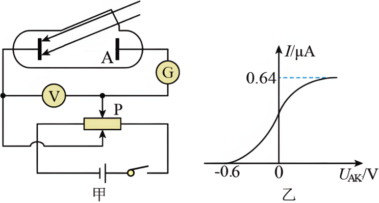

## 讲解

### 是什么

逸出功W₀是电子从材料表面逸出所需的最小能量，单位J或eV，与材料及表面状态有关。光电效应方程为

$$E_{k\max}=h\nu-W_0.$$

理想阈值满足$W_0=h\nu_0=hc/\lambda_0$。ν₀为截止频率，λ₀为极限波长，波长再长则单光子能量不足。

### 怎么来的

能量守恒给出输入hν＝逸出代价＋出射动能。取损失最小的表面电子才得到最大值，其他电子还可能因内部碰撞等损失能量，因此初动能小于这个上限。

下题以遏止电压先测最大动能，再从入射光子能量减去它得到W₀。这比直接把电子动能当成全部光子能量更可靠。

代入入射波长时使用真空关系ν=c/λ，微米要转成米，J与eV必须统一。

### 什么时候能用

同一表面、普通单光子模型适用。若hν<W₀，不能把方程算出的负值解释为真实电子具有负动能；它表示该模型下不能发生逸出。

E_k与ν是有截距的线性关系，不是正比。材料换了，W₀变了，不能只比较光频率来比较最大动能。

## 例题

> 题目与解析：高二物理热学第四章  单元测试·提升卷（解析版）.docx，来源ID S10，第57—69段。分段选取时保留该子问的完整题干、答案与解析；题目背景和原资料标注照录。

6．图甲是研究光电效应规律的电路图，用波长λ=0.50μm的绿光照射阴极K，实验测得流过G表的电流I与A、K之间的电势差$U_{AK}$满足如图乙所示的规律，普朗克常量h=6.63×$10^{-34}$J⋅s，元电荷e=1.6×$10^{-19}$C，真空中的光速c=3.0×$10^{8}$m/s，下列说法正确的是（　　）

A．当$U_{AK}$足够大时，阴极每秒钟发射的光电子数为4.0×$10^{11}$个

B．光电子飞出阴极K时的最大动能为9.6×$10^{-19}$J

C．该阴极材料的截止频率为4.6×$10^{13}$Hz

D．该阴极材料的极限波长为0.66μm

**原资料答案：** D

**原资料详解：** 

A．由题图可知，饱和电流为0.64μA，则阴极每秒钟发射的光电子数$n=\frac{It}e=\frac{0.64\times10^{-6}\times1}{1.6\times10^{-19}}=4.0\times10^{12}$，故A错误；

B．由题图可知，发生光电效应时的遏止电压为0.6V，所以光电子的最大初动能$E_{km}=eU_c=1.6\times10^{-19}\times0.6\,\mathrm J=9.6\times10^{-20}\,\mathrm J$，故B错误；

CD．根据光电效应方程有$E_{km}=\frac{hc}\lambda-W_0$

又$W_0=h\nu_0=\frac{hc}{\lambda_0}$

代入数据得$ν_{0}$=4.55×$10^{14}$Hz，$λ_{0}$=0.66μm，故C错误，D正确。

故选D。

### 顺着本题再看清一步

入射光子能量$hc/\lambda=3.978\times10^{-19}\,\mathrm J$，遏止电压给$E_{k\max}=eU_c=9.6\times10^{-20}\,\mathrm J$。

两者相减得$W_0=3.018\times10^{-19}\,\mathrm J$，再除h得$\nu_0\approx4.55\times10^{14}\,\mathrm{Hz}$，用$c/\nu_0$得$\lambda_0\approx0.66\,\mathrm{\mu m}$。

## 易错

A每秒电子数少了一个数量级；B最大动能也大了一个数量级；C截止频率少了一个数量级；D极限波长0.66 μm与计算一致。
