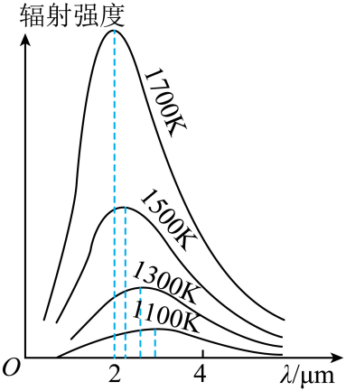

## 讲解

### 是什么

黑体是完全吸收入射各种波长电磁辐射的理想模型，不以外观颜色定义。黑体可以发出热辐射；高温时可见辐射很强，看起来会明亮。

黑体辐射谱是不同波长上辐射强度的分布，同一温度下由温度决定。温度升高，总辐射增强，峰值波长向短波移动；不能把“峰值移向短波”说成全部光子都有同一波长。

### 怎么来的

小孔空腔使入射光在壁面多次反射、吸收，很难逃出，可作为近似黑体。不同材料的普通物体辐射还受材料、表面影响；黑体模型去掉这些差异，便于研究普遍温度规律。

经典理论不能同时解释整个实验谱形。普朗克引入能量交换以$h\nu$为单位的量子假设，解释了黑体辐射规律。频率可以连续分布，因此能量交换一份一份不意味着黑体只发几个离散频率。

这是拓展，考试给出关系或涉及测温时可用：$\lambda_{\max}T=b$为维恩位移关系，b是常量；同一辐射面积的黑体总功率随$T^4$增大。

### 什么时候能用

比较图像先区分某波长处的谱强度、峰值位置与全波段总量。真实物体近似黑体时才直接用相关模型；面积不同的物体不能只靠温度比较总功率。

资料S03第74—81段把连续谱与能量量子混淆并错判B，本条改用另一道已核对原题。连续谱口径核对见[OpenStax黑体辐射](https://openstax.org/books/university-physics-volume-3/pages/6-1-blackbody-radiation)。

## 例题

> 题目与解析：第四章  原子结构和波粒二象性（专项训练）（解析版）.docx，来源ID S02，第46—57段。分段选取时保留该子问的完整题干、答案与解析；题目背景和原资料标注照录。

4．（多选）（24-25高二下·新疆喀什·期末）普通物体辐射出去的电磁波在各个波段是不同的，具有一定的分布规律，这种分布与物体本身的特性及其温度有关，因而被称之为热辐射。黑体辐射实验规律如图所示，下列说法正确的是（　　）

A．黑体辐射强度按波长的分布只跟黑体温度有关，与黑体材料无关

B．当温度降低时，各种波长的电磁波辐射强度均有所增加

C．当温度升高时，辐射强度峰值向波长较短的方向移动

D．黑体不能够完全吸收照射到它上面的所有电磁波

**原资料答案：** AC

**原资料详解：** 

A．黑体辐射强度按波长的分布只跟黑体温度有关，与黑体材料无关，故A正确；

B．当温度降低时，各种波长的电磁波辐射强度均有所减小，故B错误；

C．当温度升高时，辐射强度峰值向波长较短的方向移动，故C正确；

D．黑体之所以称为黑体，就是能够完全吸收照射到它上面的所有电磁波，故D错误。

故选AC。

## 易错

A正确，黑体模型由温度定分布；B把降温说成辐射增强；C正确，峰向短波移；D与黑体完全吸收的定义相反。
