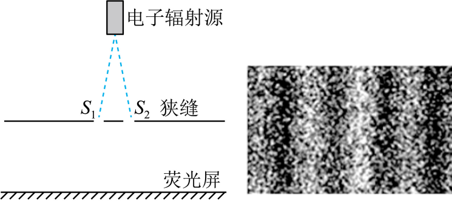

## 讲解

### 判据

看实验测量对象与现象：光干涉、衍射、偏振支持波动性；光电效应的频率阈值支持量子能量交换；康普顿散射的波长变化和反冲支持光子能量、动量模型。

### 流程

1. 先确定粒子是光子还是电子，物质波干涉不能直接替换光实验对象。
2. 把可观察事实说完整：条纹是空间强度或概率分布，电子逸出是局部能量交换，散射变波长是能量与动量转移。
3. 对波动现象，用叠加、相位联系解释；对光子现象，用E=hν、p=h/λ和守恒联系解释。
4. 避免“证明波动性所以没有粒子性”的互斥结论，同一对象可以同时需要两种性质。
5. 对单个电子逐次双缝图，落点局部、累计条纹同时出现，说明粒子描述不能取代概率波的叠加。

## 例题

> 题目与解析：高二物理热学第四章  单元测试·提升卷（解析版）.docx，来源ID S10，第24—32段。分段选取时保留该子问的完整题干、答案与解析；题目背景和原资料标注照录。

3．物理学家利用“托马斯·杨”双缝干涉实验装置，进行电子干涉的实验被评为“十大最美物理实验”之一，从辐射源辐射出的电子束经两靠近的狭缝后在显微镜的荧光屏上出现干涉条纹，该实验说明（　　）

A．光具有波动性

B．光具有波粒二象性

C．微观粒子本质是一种电磁波

D．微观粒子具有波动性

**原资料答案：** D

**原资料详解：** 干涉是波所特有的现象，电子的双缝干涉说明微观粒子具有波动性。

故选D。

## 易错

此题实验对象是电子，D才对应它的波动性；A、B换成光而失去对象对应；C把物质波说成电磁波，错误。本条借该原题练习先核对象，没有冒充光实验。
