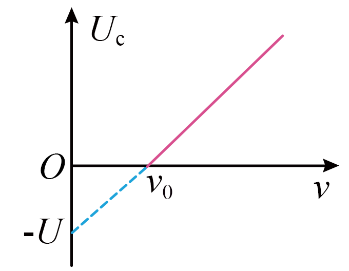

## 讲解

### 判据

对同一材料，U_c-ν图像超过阈值部分是直线。横轴截距ν₀给截止频率，延长线的纵截距−W₀/e给逸出功，斜率h/e给普朗克常量。负电压延长段是数学外推，不是低频时真实的负遏止电压。

### 流程

1. 看清纵轴是遏止电压大小U_c，不是带符号的U_AK；横轴频率的10的幂也应计入。
2. 从两条基本式eU_c=E_kmax与E_kmax=hν−W₀出发，代入并除e，得到U_c=(h/e)ν−W₀/e。
3. 原图横截距ν₀、纵截距−U，故W₀=hν₀=eU，斜率U/ν₀=h/e，得到h=eU/ν₀。
4. 代入指定2ν₀，有U_c=(h/e)2ν₀−W₀/e=2U−U=U。
5. 图只给频率没有光强，不能确定饱和电流是否增大。

## 例题

> 题目与解析：第四章 原子结构与波粒二象性 （复习讲义）（解析版）.docx，来源ID S03，第193—211段。分段选取时保留该子问的完整题干、答案与解析；题目背景和原资料标注照录。

【变式4-1】（多选）某种金属在光的照射下产生光电效应，其遏止电压$U_c$与入射光频率$\nu$的关系图像如图所示（图中截距为已知量）。则由图可知（　　）

A．该金属的逸出功等于$h\nu_0$

B．入射光的频率为$2\nu_0$时，遏止电压为$U$

C．若电子电量绝对值为$e$，则普朗克常量$h=\frac{eU}{\nu_0}$

D．采用频率为$3\nu_0$的入射光时，饱和光电流必增大

**原资料答案：** ABC

**原资料详解：** 

A．根据光电效应方程和动能定理可得，有$E_k=h\nu-W_0=eU_c$

当$U_c=0$时，有$h\nu_0=W_0$

故该金属的逸出功等于$h\nu_0$，故A正确；

BC．根据$E_k=h\nu-W_0=eU_c$

可得$U_c=\frac he\nu-\frac{W_0}e$

由题图可知$\frac{W_0}e=U$

则有$W_0=h\nu_0=eU$

可得普朗克常量为$h=\frac{eU}{\nu_0}$

当入射光的频率为$2\nu_0$时，可得$E_k^\prime=h\cdot2\nu_0-W_0=eU_c^\prime$

解得遏止电压为$U_c^\prime=U$，故BC正确；

D．饱和光电流由光强决定，与入射光的频率没有直接关系，故D错误。

故选ABC。

## 易错

A、B、C分别对应阈值、代入、斜率，正确；D由频率变大就断言电流增大，条件不足。原解析D简写“由光强决定”，本条补上同频及收集条件。
